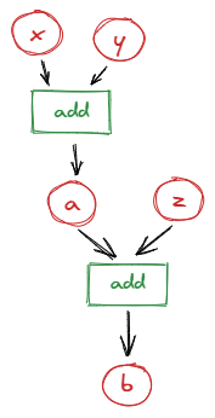
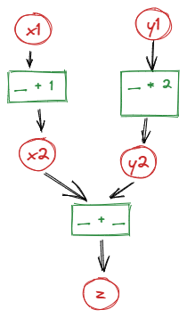
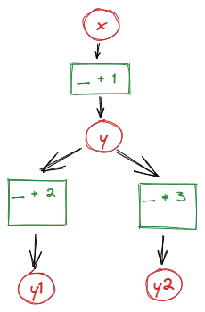
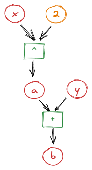
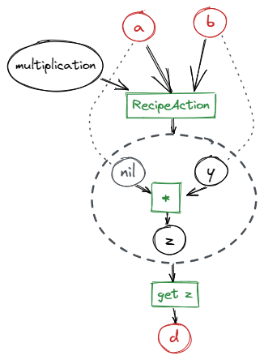

.. SPDX-FileCopyrightText: 2026 Jan Kleinert <jan.kleinert@dlr.de>
..
.. SPDX-License-Identifier: MPL-2.0

*************
Usage 
*************

Target audience: C++ developers who want static features, and Python users using dynamic features via the Python bindings. Assumes basic familiarity with C++/Python, templates, and Lua for dynamic mode.

If you are interested in using grunk as a backend for your C++ code, the :ref:`section on static mode <usage-static-mode>` and 
the :ref:`section on parallel execution <usage-parallel-execution>` are a good starting point. 

If you plan to use grunk entirely for scripting and manipulating grunk recipes, these sections can be skipped, because the python bindings only support grunk's dynamic mode and the reading and writing of grunk recipes to file. However, to fully grasp grunk's caching, lazy evaluation and automatic invalidation logic, it may be beneficial not to do so.

.. _usage-static-mode:

Static Mode
===========

Static mode summary: compile-time type knowledge and function bindings. Use static mode when all types and functions are known at compile time and you need lazy evaluation, caching, and the option for parallel execution (C++ only).

Lazy evaluation and Caching
---------------------------

As an introductory example, consider the following function
that adds two ``double``\s and is a bit talkative about it.

.. code-block:: cpp
   
   double add(double const& l, double const r)
   {
       std::cout << "Adding " << l << " and " << r << std::endl;
       return l + r;
   };

grunk lets you delay the evaluation of the function until the result is queried.

.. code-block:: cpp

   #include <grunk/grunk.hpp>

   auto o = grunk::action(&add, 1.2, 40.8);
   o.set_id("o");
   
   std::cout << "Until here, nothing has happened" << std::endl;

   std::cout << o.value() << std::endl;
   std::cout << o.value() << std::endl;

.. code-block:: console

   Until here, nothing has happened
   Adding 1.2 and 40.8
   42
   42

In the first line no computation takes place, the function ``add`` is not evaluated.
Instead, 
a new ``Action`` instance ``o`` is created using ``grunk::action``.
The arguments are a function pointer ``&add`` and two arguments
that shall be passed into the function. With ``set_id("o")`` we add an id to the output feature.

Internally, ``o`` depends on the action created
by ``grunk::action``; that action in turn depends on two ``Feature<double>`` inputs holding the values ``1.2`` and ``40.8``. With this dependency 
information, grunk can delay the computation to the point when ``o.value()`` 
is called. At this time, the function must be evaluated and the result, ``42``, is 
stored in ``o``. The next time the value is queried, the compuation is not repeated,
the cached result is returned. This is called **lazy evaluation**, because computations 
are delayed until the last point possible and only necessary calculations are performed.

Automatic invalidation
----------------------

Let's modify the above code example a bit. 

.. code-block:: cpp
   
   grunk::Feature x(1.2).with_id("x");
   grunk::Feature y(15.2).with_id("y");
   grunk::Feature z(25.6).with_id("z");

   auto a = grunk::action("a", &add, x, y);
   auto b = grunk::action("b", &add, a, z);

We have created three independent features ``x,y,z``. The feature
``a`` is the result of adding ``x`` and ``y`` and the feature ``b`` is the 
result of adding ``a`` and ``z``.

If we would now query the value of ``a``, ``b`` would 
not be computed, because ``a`` does not depend on ``b``. If instead,
we were to query the value of ``b``, ``a`` would have to be computed first. 
Let's try this:

.. code-block:: cpp
   
   std::cout << b.value() << std::endl;

.. code-block:: console
   
   Adding 1.2 and 15.2
   Adding 16.4 and 25.6
   42

If we now were to change ``z``, ``b`` would have to be recomputed the 
next time its value is queried. ``a`` which does not depend on ``z``
does not need to be recomputed.

.. code-block:: cpp
   
   z.change_value() = 24.2;
   
   std::cout << "No calculations done until this point" << std::endl;
   std::cout  << b.value() << std::endl;

.. code-block:: console 
   
   No calculations done until this point
   Adding 16.4 and 24.2
   40.6

If we were to change ``x``, both ``a`` and ``b`` have to be re-computed and 
grunk knows this:

.. code-block:: cpp 
   
   x.change_value() = 2.6;

   std::cout << "No calculations done until this point" << std::endl;
   std::cout  << b.value() << std::endl;

.. code-block:: console
   
   No calculations done until this point
   Adding 2.6 and 15.2
   Adding 17.8 and 24.2
   42

This functionality is called **automatic invalidation**: Only features that depend on a changed feature are invalidated. 

Caching & invalidation (summary)

   - Querying a feature's value triggers evaluation and fills caches for that feature and all computed ancestors required for the result.
   - Changing an independent input invalidates only those features that depend (directly or transitively) on that input.
   - Re-querying a feature after an invalidation recomputes only the invalidated portions of the tree.

Lazy evaluation and automatic invalidation come with the trade-off of having to 
store dependency information, but it pays off
for big workflows with many computationally expensive functions. This becomes especially 
apparent in explorative design or automated optimization workflows, where input parameters 
can be expected to be altered frequently.

Conceptually, the ``Feature<double>`` correspond to a node in a *directed acyclic graph* 
(DAG). This graph is often called a **feature tree**. grunk retains these feature trees 
by retaining parent-child relations in the ``Feature<T>`` instances.

This mode of operation is also called **static mode**, because all types and functions are known at compile time.
If you want to use types and functions provided by plugins which are loaded at run time, you have to use grunk's **dynamic mode**, see the section on :ref:`dynamic mode<usage-dynamic-mode>`.

Classes and Member Functions
----------------------------

The concept works with any kind of type and function. The only requirement for the functions is, that they are **referentially transparent**, which means they may not alter their inputs *(in other words: no functions that mutate their arguments or rely on hidden global state)*.

.. code-block:: cpp

   #include <grunk/grunk.hpp>

   struct MyScalar {
         double get() const { return v; }
         double v;
   };

   auto x = grunk::feature(MyScalar{17.}).with_id("x");
   auto y = grunk::action(&MyScalar::get, x).with_id("y");

   // prints 17
   std::cout << y.value().v << std::endl;

   x.change_value().v = 25.;

   // prints 25
   std::cout << y.value().v << std::endl;

.. _usage-parallel-execution:

Parallel Execution
------------------

Consider the following grunk recipe:

.. code-block:: cpp

   #include <grunk/grunk.hpp>
   
   auto x1 = grunk::feature(1.);
   auto x2 = grunk::action({ return v + 1.; }, x1);
   x2.set_id("x2");

   auto y1 = grunk::feature(2.);
   auto y2 = grunk::action({ return v * 2.; }, y1);
   y2.set_id("y2");

   auto z = grunk::action({ return a + b; }, x2, y2);
   z.set_id("z");

Setting aside that parallel execution is not reasonable for this example, note that ``x2`` and ``y2`` can be computed in parallel, because they do not depend on each other.

Since grunk tracks parametric dependencies, it can use this information to deduce which parts of a parametric tree 
can be executed in parallel - provided that the functions themselves are thread-safe.

.. admonition:: Thread-safety

   Parallel execution requires that all user functions invoked are thread-safe and side-effect free. Exceptions thrown during parallel evaluation may be propagated to the caller; consult the API for exact exception semantics.

To do so, we can use the ``ParallelExecutor``:

.. code-block:: cpp

   grunk::ParallelExecutor executor(z);
   executor.run();

You can also specify the number of threads to use for the parallel execution:

.. code-block:: cpp

   int nthreads = 2;
   grunk::ParallelExecutor executor(nthreads, z);
   executor.run();

Parallel execution will use multiple threads to evaluate independent parts of the tree; any exceptions thrown during evaluation will propagate to the calling thread.

The parallel executor uses the `taskflow <https://github.com/taskflow/taskflow>`_ library under the hood. If you want to see the actual task graph that gets executed, you can dump it to a file:

.. code-block:: cpp 

   std::string graphviz = executor.get_taskflow().dump();

   std::ofstream fout("my_taskflow.dot");
   fout << graphviz;

.. image:: images/parallel_execution_graphviz.png
   :alt: Parallel execution of a feature tree

The class ``ParallelExecutor`` takes a set of features as input and executes all computations necessary to evaluate these features in parallel, if possible.

.. code-block:: cpp

   #include <grunk/grunk.hpp>

   auto x  = grunk::feature(1.).with_id("x");
   auto y  = grunk::action({ return v + 1.; }, x).with_id("y");
   auto y1 = grunk::action({ return v * 2.; }, y).with_id("y1");
   auto y2 = grunk::action({ return v * 3.; }, y).with_id("y2");
   
   grunk::ParallelExecutor executor(y1, y2);

Note, that parallel execution is only possible in static mode. 
Dynamic mode relies on Lua. Like most scripting languages, Lua is single-threaded 
and does not support parallel execution.

.. _usage-dynamic-mode:

Dynamic Mode
============

Dynamic mode summary: runtime (Lua-based) typing and plugin-driven behavior. Use dynamic mode when types or functions are provided by plugins or when scripting from Python/Lua; note that Lua-based dynamic mode is single-threaded and does not support the `ParallelExecutor`.

grunk's dynamic mode uses Lua as a dynamic scripting language to work with types and functions provided by plugins. The implementation is based on the `sol2 <https://github.com/ThePhD/sol2>`_ library and a ``grunk::object`` is just an alias for a ``sol::object``.

Before we dive into the parametric trees of grunk's dynamic mode, let's first see how to interact with the underlying Lua state.

Interacting with the Lua state
------------------------------

Grunk's dynamic mode is the basis for using grunk with plugins. It relies on a runtime reflection system and a type-erased object called ``grunk::object``. This allows grunk to work with any kind of type and function provided by plugins, without the need to know about them at compile time.

An instance of ``grunk::state`` is used to manage the dynamic state and register types and functions in an internal Lua state.

In practice, functions and types are registered in a ``grunk::state`` via grunk plugins, see the :ref:`next section <using-plugins>` section. For simplicity, assume for now that the type ``MyScalar`` and a function ``add`` are registered in the grunk state and can be used in the feature tree.

.. code-block:: cpp

   #include <grunk/grunk.hpp>

   struct MyScalar
   {
       double get() const { return v; }
       double v;
   };

   grunk::state grunk;
   grunk.register_type<MyScalar>("MyScalar")
   .add_constructor<double>()
   .add_member_function("get", &MyScalar::get);

   grunk.register_function(
      "add", 
      { 
         return l + r; 
      }
   );

Now, we can use the registered type and function in a Lua script. 

.. tabs:: 

   .. code-tab:: cpp 

         #include <grunk/grunk.hpp>
   
         grunk::state grunk;

         /* type and function registration omitted here */

         auto env = grunk.create_env();
         env.eval(R"(
            local x = MyScalar.new(17.)
            local y = MyScalar.new(25.)
            local z = add(x,y)
            result = z:get() ^ 2 + 5
         )");
         std::cout << env.get<double>("result") << std::endl;

   .. code-tab:: python 
   
         import grunk

         # type and function registration omitted here

         env = grunk.create_env()
         env.eval("""
            local x = MyScalar(17.)
            local y = MyScalar(25.)
            local z = add(x,y)
            result = z:get() ^ 2 + 5
         """)
         print(env.get("result").as_float())

The script passed to ``env.eval`` can be any valid Lua code. The function ``env.get`` can be used to retrieve any variable from the Lua state and cast it to a type that we can deal with in C++ or Python.
We can retrieve the variable as a grunk::object and then use the ``as`` function to cast it back to the actual type.
Conversely, we can also create a grunk::object from a C++ type and pass it to the Lua state.

Short note on evaluation and caching

   Calling ``env.eval`` and invoking ``:value()`` inside the parametric environment triggers evaluation and fills caches for the parametric sub-tree used to compute that value. Subsequent changes to input features (from Lua or from C++/Python via ``get_feature``/``set_value``) will invalidate dependent caches and cause recomputation at the next ``:value()`` call.

.. code-block:: cpp

   #include <grunk/grunk.hpp>

   grunk::state grunk;

   /* type and function registration omitted here */
   
   auto env = grunk.create_env();

   env["x"] = MyScalar(17.);
   env["y"] = MyScalar(25.);
   env.eval("result = add(x,y):get()");
   std::cout << env.get<double>("result") << std::endl;

The usage from Python is very similar, with a few minor caveats. 

Firstly, python types cannot be registered in the grunk state, because they are not known to C++. Instead, we can only work with native Lua types and types that are registered in the grunk state via plugins.

Secondly, for convenience, the `grunk` module comes with a default `grunk::state` instance and
the member functions of `grunk::state` are exposed as free functions. So from python we have the choice of working with the default state or creating 
our own state and working with it.

.. code-block:: python

   import grunk

   # use the default state
   env = grunk.create_env()

   # or create a new state called grnk and use it
   grnk = grunk.state()
   env2 = grnk.create_env()

``env`` and ``env2`` are independent environments with a shared Lua state. They share the same registered types and functions.

Dynamic Features and Actions in Lua
-----------------------------------

Notice that in the example above, we have only used the functions in a dynamic context. We did not make use of grunk's dependency tracking. 
The following example shows how to use grunk's dynamic mode together with the dependency tracking of features and actions.

We can create a parametric environment from our ``grunk::state``. Within this environment, all functions are decorated as a ``grunk::Action``, a function wrapper that tracks the dependency.

.. tabs::

   .. code-tab:: cpp 

         #include <grunk/grunk.hpp>
   
         grunk::state grunk;

         auto env = grunk.create_parametric_env();
         env.eval(R"(
            x = grunk.feature(2.)
            y = grunk.feature(38.)

            a = x ^ 2
            b = a + y  

            b1 = b:value()

            x:set_value(1)

            b2 = b:value()
         )");

         // prints 42
         auto b1 = env.get("b1").as<double>();
         std::cout << "b1 = " << b1 << std::endl;

         // prints 39
         auto b2 = env.get("b2").as<double>();
         std::cout << "b2 = " << b2 << std::endl;

         auto y = env.get_feature("y"); // short for env.get<grunk::DynamicFeature>("y")
         y.set_value(41);

         // prints 42
         auto b3 = env.get_feature("b").value().as<double>();
         std::cout << "b3 = " << b3 << std::endl;

   .. code-tab:: python 
   
         import grunk

         env = grunk.create_parametric_env()
         env.eval("""
            x = grunk.feature(2.)
            y = grunk.feature(38.)

            a = x ^ 2
            b = a + y  

            b1 = b:value()

            x:set_value(1)

            b2 = b:value()
         """)

         # prints 42
         b1 = env["b1"].as_float()
         print(f"b1 = {b1}")

         # prints 39
         b2 = env["b2"].as_float()
         print(f"b2 = {b2}")

         y = env.get_feature("y")
         y.set_value(41)

         # prints 42
         b3 = env.get_feature("b").value().as_float()
         print(f"b3 = {b3}")

Observe carefully how the lazy evaluation and automatic invalidation logic works here. The first time ``b:value()`` is called from the Lua script, the value of the feature is queried and the parametric tree is evaluated. The caches of every feature of the underlying parametric tree are filled. Subsequently the value of ``x`` is changed, which invalidates ``a`` and ``b``. The next time ``b:value()`` is called, the parametric tree is reevaluated and the value of ``b`` changes. 

Short summary: calling ``:value()`` inside the running Lua script triggers evaluation and fills caches for that parametric tree; later changes to inputs will invalidate dependent caches and cause recomputation on the next ``:value()`` call.

In the following, we are retrieving the feature ``y`` from the ``grunk::state`` and manipulate it in C++/Python. As we change the value, the cache of ``a`` remains intact, but the cache of ``b`` is invalidated. Querying the value of ``b`` again (this time from C++/Python), only part of the feature tree is re-evaluated and the value of ``b`` changes again.

Using Custom Types
------------------

Let us examine how a parametric tree with custom types from plugins would look like. Assume that we have a plugin that registers the type ``MyScalar`` and a function ``add`` that takes two ``MyScalar``\s and returns their sum.

For brevity, we will only show the Lua script that can be executed in a grunk parametric environment.

When we want to construct a custom type as part of the feature tree, we have two options. We can either use the constructor of the type as an action, which means that the constructed object depends on the input features. Or we can forward the constructor arguments to ``grunk::feature`` by using the ``new_feature`` method, which means that the constructed object is an independent feature.

.. code-block:: LUA

   local a = grunk.feature(1.)

   x = MyScalar.new(a)             -- ctor as action: x depends on a
   y = MyScalar.new(2.)            -- ctor as action with argument conversion from constant: y depends on unnamed Feature(2.)
   z = MyScalar.new_feature(3.)    -- forwards ctor args to grunk::feature: z is independent feature

A ``grunk::DynamicFeature`` (the alias for ``grunk::Feature<grunk::object>`` that ``x``, ``y`` and ``z`` above all are) does not statically know the type it wraps, so calling a member function of the underlying type directly on it, using the ``:`` operator as if it were a plain ``MyScalar``, needs a little help to find the right method. This is exactly what plain colon-call syntax does, and it is the recommended, default way to invoke a registered method on a feature:

.. code-block:: LUA

   local b = x:val() - MyScalar.val(y)
   print(b:value())  -- prints -1, because x has the value 1 and y has the value 2

.. admonition:: How ``feature:method(...)`` finds "method"

   Since a feature's value may not have been computed yet (that's the whole point of
   lazy evaluation), grunk cannot simply look at the value to find out which type's
   methods to search. Instead, every feature that comes from a registered constructor
   or member-function call carries a small runtime type hint, stamped on it when it is
   built - never by evaluating it. A colon-call looks up the method using that hint.

   In rare cases a feature has no such hint (for instance, one built directly from a
   generic value with no concrete C++ type in hand, e.g. ``grunk.feature(42)``). For
   those, colon-call raises a clear error telling you to fall back to one of the two
   explicit alternatives instead - it will never silently force-evaluate the feature
   just to find a type, since that would defeat caching and lazy invalidation:

   1. ``x:as(MyScalar).val()`` - obtain a Lua usertype that exposes the member
      functions as actions.
   2. ``MyScalar.val(x)`` - call the qualified free-function form directly, passing the
      feature as the first argument.

Dynamic Features and Actions in C++/Python
------------------------------------------

In the examples so far, the dynamic mode was used from within a Lua script. There are two kinds of environments. ``grunk::create_env`` returns an environment where all registered functions and methods are exposed as is, ``grunk::create_parametric_env`` returns an environment where all registered functions and methods are exposed as `actions`, meaning they are decorated functions that register the parametric dependency and delay the function evaluation. There is no need to explicitly wrap the method in a ``grunk::action`` as in static mode. 

However, this syntax is available for dynamic mode as well, without using Lua environments.

Instead of passing a function or function pointer to ``grunk::action``, we can 
pass a string identifier. We can choose between ``.`` and ``:`` as separator.

.. tabs::

   .. code-tab:: cpp 

      #include <grunk/grunk/hpp>

      auto grunk = grunk::state;

      /* type and function registration omitted here */

      auto a = grunk.feature(1.);

      auto x = grunk.action("MyScalar:new", a);       // ctor as action: x depends on a
      auto y = grunk.action("MyScalar.new", 2.);      // ctor as action with argument conversion from contant: y depends on Feature(2.)
      auto z = grunk.feature("MyScalar", 3.);         // forwards ctor args to grunk::feature: z is independent feature

      auto b = grunk.action("MyScalar.val", x) - grunk.action("MyScalar:val", y);

      // prints -1
      std::cout << b.value().as<double>() << std::endl;

   .. code-tab:: python

      import grunk

      # type and function registration omitted here

      a = grunk.feature(1.)

      x = grunk.action("MyScalar:new", a)       # ctor as action: x depends on a
      y = grunk.action("MyScalar.new", 2.)      # ctor as action with argument conversion from contant: y depends on Feature(2.)
      z = grunk.feature("MyScalar", 3.)         # 3 forwards ctor args to grunk::feature: z is independent feature

      b = grunk.action("MyScalar.val", x) - grunk.action("MyScalar:val", y)

      # prints -1
      print(b.value().as_float())

If we already have a ``DynamicFeature`` in hand and just want to call one of its methods - the C++/Python equivalent of Lua's ``x:val()`` colon-call - ``DynamicFeature::call`` does the same relative-name lookup described above, without needing to look the type up in ``grunk::state`` first:

.. tabs::

   .. code-tab:: cpp

      auto z = x.call("val");         // relative name, resolved via x's type hint
      auto z2 = x.call("MyScalar.val"); // fully-qualified name also works, regardless of any type hint

   .. code-tab:: python

      z = x.call("val")
      z2 = x.call("MyScalar.val")

Mixing static and dynamic mode in C++
-------------------------------------

Remember, that static mode is only available in C++.

In C++ we can pass static features to dynamic functions.
The conversion is handled under the hood. 

.. code-block:: cpp

   grunk::state grunk;

   auto add = { return l+r; };
   grunk.register_function("add", &add);

   auto a = grunk::feature(1);          // type of a: Feature<int>
   auto b = grunk.feature(2);           // type of b: Feature<object>
   auto c = grunk.action("add", a, b);  // type of d: Feature<int>

   // Until here, add has not been called, but only the DAG assembled, 
   // that represents the dependency of the features. Now let's trigger
   // evaluation by querying the value of e.

   assert(c.value().as<int> == 3);

   // After evaluation all results, including intermediate results are
   // cached. A second query of e would just retrieve the value from
   // cache

   // resetting an independent input feature invalidates all dependent
   // nodes. Resetting c will invalidate e, but the cache of d remains
   // valid
   b.set_value(4);

   // A new query of e will trigger evaluation of all invalid nodes.
   assert(c.value() == 5);

Containers
----------

Imagine you have a function that expects an ``std::vector``.

.. code-block:: cpp

   struct Foo {
      int i;
   };

   Foo add(std::vector<Foo> const& v) {
      return std::accumulate(
         v.begin(), 
         v.end(), 
         Foo{0.}, 
         { return Foo{l.i + r.i}; }
      );
   }

If we have several ``grunk::DynamicFeature``\s, each wrapping a ``Foo`` instance, we can create a vector ``std::vector<grunk::DynamicFeature>``. 
But the action decorator for ``add`` expects a single `grunk::DynamicFeature`` wrapping an ``std::vector<Foo>``.

To perform the conversion, the type ``Foo`` has to be registered with the 
``with_std_vector`` method. This adds a method ``as_vec`` to the metatable of the usertype of ``Foo``, which is an action that unwraps the input features, then inserts them in an ``std::vector`` and wraps it in a ``grunk::DynamicFeature``, all the while properly registering the parametric dependency of the inputs to the output vector.

.. code-block:: cpp

   #include <grunk/grunk.hpp>

   auto grunk = grunk::state();

   grunk.register_type<Foo>("Foo")
   .add_constructors({ return Foo{i}; })
   .with_std_vector();

   grunk.register_function("add", &add);

   auto env = grunk.create_parametric_env();
   env.eval(R"(
      x1 = Foo.new_feature(5)
      x2 = Foo.new_feature(7)
      x3 = Foo.new_feature(9)

      res = add(Foo.as_vec(x1, x2, x3))
   )");

   auto res = env.get_feature("res");

   // prints 21
   std::cout << res.value().as<Foo>().i << std::endl;

   auto x1 = env.get_feature("x1");
   x1.set_value(Foo{26});

   // prints 42
   std::cout << res.value().as<Foo>().i << std::endl;

Currently, ``std::vector`` is the only C++ container supported by grunk. 

Consider a CAD plugin providing the following functions:

.. code-block:: cpp

   Curve interpolate(std::vector<Point> const&);
   Surface interpolate(std::vector<Curve> const&);

If both ``Point`` and ``Curve`` are registered in the dynamic type system using the ``with_std_vector`` method, we can generate parametric models that look like the following.

.. tabs::

   .. code-tab:: cpp 

         // ... omitted
         auto points3 = grunk.action("my_cad.Point.as_vec", pnt31, pnt32, pnt33, pnt34).with_id("points3");

         auto curve1 = grunk.action("my_cad.interpolate", points1).with_id("c1");
         auto curve2 = grunk.action("my_cad.interpolate", points2).with_id("c2");
         auto curve3 = grunk.action("my_cad.interpolate", points3).with_id("c3");
         auto curves = grunk.action("my_cad.Curve.as_vec", curve1, curve2, curve2)
         auto surface = grunk.action("my_cad:interpolate", curves).with_id("s");

   .. code-tab:: python

         # ... omitted
         points3 = grunk.action("my_cad.Point.as_vec", pnt31, pnt32, pnt33, pnt34).with_id("points3")

         curve1 = grunk.action("my_cad.interpolate", points1).with_id("c1")
         curve2 = grunk.action("my_cad.interpolate", points2).with_id("c2")
         curve3 = grunk.action("my_cad.interpolate", points3).with_id("c3")
         curves = grunk.action("my_cad.Curve.as_vec", curve1, curve2, curve2)
         surface = grunk.action("my_cad:interpolate", curves).with_id("s")

   .. code-tab:: yaml

         uses:
           grunk: 0.5.0
           my_cad: 1.0.0
         parameters:
           # ... omitted
         steps: |
           -- ... omitted
           points3 = my_cad.Point.as_vec(pnt31, pnt32, pnt33, pnt34)
           c1 = my_cad.interpolate(points1)
           c2 = my_cad.interpolate(points2)
           c3 = my_cad.interpolate(points3)
           s = my_cad.interpolate(my_cad.Curve.as_vec(c1, c2, c3) )

.. _module:

Modules
-------

A grunk module is a named table of Lua functions, backed by a plain Lua script, that is registered
directly on a ``grunk::state`` - the same place that ``register_type`` and ``register_function`` put
their symbols. Use ``run_module_script`` (or ``run_module_file``, to load from disk) to define a
module:

.. tabs::

   .. code-tab:: cpp

       #include <grunk/grunk.hpp>

       grunk::state grunk;
       grunk.run_module_script(
          "mymod",
          R"(
             function less_than(l,r)
                return l < r
             end

             function if_then_else(cond, i, e)
                if cond then
                   return i
                else
                   return e
                end
             end
          )"
       );

       // a plain environment sees plain, uninstrumented functions
       auto env = grunk.create_env();
       env.eval(R"(
          a = 2
          b = 3
          c = mymod.if_then_else(mymod.less_than(a,b), 5, 32)
       )");

   .. code-tab:: python

       import grunk

       grunk.run_module_script(
          "mymod",
          """
          function less_than(l,r)
             return l < r
          end

          function if_then_else(cond, i, e)
             if cond then
                return i
             else
                return e
             end
          end
          """
       )

       # a plain environment sees plain, uninstrumented functions
       e = grunk.create_env()
       e.eval("""
           a = 2
           b = 3
           c = mymod.if_then_else(mymod.less_than(a,b), 5, 32)
       """)

In a parametric environment, every function exported by a module is decorated into an action, just
like any other symbol registered on the state, so calls into the module integrate with grunk's
dependency tracking:

.. tabs::

   .. code-tab:: cpp

       auto penv = grunk.create_parametric_env();
       penv.eval(R"(
          a = grunk.feature(2)
          b = grunk.feature(3)
          c = mymod.if_then_else(mymod.less_than(a,b), 5, 32)
       )");

       auto c = penv.get_feature("c");
       std::cout << c.value().as<int>() << std::endl;

       auto a = penv.get_feature("a");
       a.set_value(4);

       std::cout << c.value().as<int>() << std::endl;

       // remove the module once done with it
       grunk.clear_module("mymod");

   .. code-tab:: python

       pe = grunk.create_parametric_env()
       pe.eval("""
           a = grunk.feature(2)
           b = grunk.feature(3)
           c = mymod.if_then_else(mymod.less_than(a,b), 5, 32)
       """)

       c = pe.get_feature("c")
       assert c.value().as_int() == 5

       a = pe.get_feature("a")
       a.set_value(4)
       assert c.value().as_int() == 32

       # remove the module once done with it
       grunk.clear_module("mymod")

If you need to reload a module or replace its contents, call ``clear_module(name)`` first - this
removes the module from the original Lua environment as well as from the decorated cache, so that
subsequent parametric environments will not see stale, cached decorated values. Calling
``run_module_script``/``run_module_file`` on a module that already exists reuses the existing table
instead, so several scripts or files can incrementally populate the same module.

Module functions are particularly useful to instantiate objects and modify them using non-const
setters. grunk disallows any function that can potentially alter its inputs. This includes any
function that takes a non-const reference as argument and, in consequence, all non-const member
functions. This is an important safeguard against dependency cycles in the feature tree: as part of
the philosophy of grunk, information flows from inputs to outputs only, and any feature in the tree
is influenced only by its predecessors.

This comes with a heavy restriction, since non-const members, e.g. setters, are frequently used in
object-oriented programs. Consider the following class:

.. code-block:: cpp

   struct Pnt
   {
       Pnt() = default;

       inline void set_x(double x_) { x = x_; }
       inline void set_y(double y_) { y = y_; }
       inline void set_z(double z_) { z = z_; }

       double x{0.};
       double y{0.};
       double z{0.};
   };

Instantiating an instance of ``Pnt`` with grunk and then modifying it using ``set_x`` via
``grunk::action`` is not allowed, because ``set_x`` is a non-const member function. Instead, you can
create the instance and modify it as part of a module function:

.. tabs::

   .. code-tab:: cpp

         #include <grunk/grunk.hpp>

         grunk::state grunk;

         // registration of Pnt omitted here

         grunk.run_module_script(
            "mymod",
            R"(
               function create_pnt(u, v)
                   p = Pnt.new()
                   p:set_x(u)
                   p:set_y(v)
                   return p
               end
            )"
         );

         auto u = grunk.feature(0.1);
         auto v = grunk.feature(0.2);

         auto p = grunk.action("mymod.create_pnt", u, v);

   .. code-tab:: python

         import grunk

         # registration of Pnt omitted here

         grunk.run_module_script(
            "mymod",
            """
               function create_pnt(u, v)
                   p = Pnt.new()
                   p:set_x(u)
                   p:set_y(v)
                   return p
               end
            """
         )

         u = grunk.feature(0.1)
         v = grunk.feature(0.2)

         p = grunk.action("mymod.create_pnt", u, v)

Note that in the above example, no cycles are created because the non-const setters are not called on
features, but on intermediate variables of the function body ``mymod.create_pnt`` during the
evaluation of a single compute node. The inputs ``u`` and ``v`` are not altered.

The modules shown so far are registered directly on a ``grunk::state`` and are shared by every
recipe built from it, exactly like a registered type or function. :ref:`Recipes<subrecipes>` support a
second, reactive flavor of modules that are private to a single recipe - see
:ref:`Modules in recipes<recipe_modules>`.

Custom Pointers and Smart Pointers
----------------------------------

Not yet implemented.

.. _using-plugins:

Grunk plugins
=============

A grunk plugin is what supplies types and functions that can be used as building blocks of a
feature tree, without grunk itself ever needing to know about them at compile time. Every grunk
plugin reports a **name** and a **version** (a ``grunk::PluginInfo``), and registers everything it
provides under a Lua namespace table keyed by that name - so a script referring to ``geoml.gp_Pnt``
or ``adtl.adouble`` is always referring to some specific plugin's own table.

There are three kinds of grunk plugin, distinguished only by how much of their own implementation
is native C++ versus Lua:

* **Plain C++ plugins** register types/functions written entirely in C++, using the same
  ``register_type``/``register_function`` calls already used in
  :ref:`Interacting with the Lua state<usage-dynamic-mode>`. Fastest, but needs a C++ toolchain to
  build.
* **Compiled Lua plugins** wrap an existing compiled Lua C extension - typically one you didn't
  hand-write, e.g. a `SWIG <https://www.swig.org/>`_ binding for a large existing C/C++ library -
  as a grunk plugin.
* **Pure Lua plugins** are nothing more than a Lua script plus a name and a version. No compilation
  needed, at some runtime cost since everything runs interpreted.

grunk's dynamic scripting engine never needs to know which kind loaded a given symbol: once a
value is registered, it decorates and tracks identically regardless of provenance. Which kind to
pick is purely an authoring-time decision.

Using grunk plugins
--------------------

Loading a plugin looks slightly different per kind; using its registered types/functions
afterwards is exactly like the example in
:ref:`Interacting with the Lua state<usage-dynamic-mode>` - a plugin just puts things under its own
namespace instead of flat in the environment.

**Plain C++ and compiled-Lua plugins** are both native shared libraries (``.so`` on Linux,
``.dylib`` on macOS, ``.dll`` on Windows), and are loaded the same way, via
``grunk::plugin::load_native``:

.. code-block:: cpp

   #include <grunk/grunk.hpp>
   #include <grunk/plugin.hpp>

   grunk::state grunk;
   grunk::plugin::load_native(grunk, "geoml_plugin.so");

   auto env = grunk.create_env();
   env.eval(R"(
       p = geoml.gp_Pnt.new(1., 2., 0.)
       x = p:X()
   )");
   std::cout << env.get<double>("x") << std::endl;

``load_native`` loads the shared library, asks it for its identity (a ``grunk::PluginInfo``), and
hands control to the plugin's own registration code - whether it turns out to be a plain C++
plugin or a compiled-Lua shim makes no difference to the caller.

**Pure Lua plugins** have no shared library to load - just a name, a version, and a ``.lua`` file,
passed directly to ``grunk::state``:

.. code-block:: cpp

   #include <grunk/grunk.hpp>

   grunk::state grunk;
   grunk.load_lua_plugin_file(grunk::PluginInfo{"my_lua_plugin", "1.0.0"}, "my_lua_plugin.lua");

   auto env = grunk.create_env();
   env.eval("result = my_lua_plugin.add_one(41)");
   std::cout << env.get<int>("result") << std::endl;

(``grunk::plugin::load_script`` is a thin convenience wrapper around the same call, so all three
plugin kinds have an entry point under ``grunk::plugin``.)

Every loaded plugin's identity is recorded on the ``grunk::state`` and can be inspected via
``state::plugins()``. This is also what lets a saved :ref:`recipe<grunk-recipes>`'s ``uses:`` block
be validated on read: a recipe records every plugin it needs by name and version, and reading it
back fails immediately, with a clear message, if a required plugin was never loaded - rather than
failing later with a confusing "symbol not found" the first time a step referencing it runs.

.. note::

   The Python bindings currently only expose *using* an already-loaded ``grunk::state``
   (``env.eval``, ``feature``, ...), not loading a native plugin itself -
   ``grunk::plugin::load_native`` and the ``load_*_plugin``/``begin_plugin`` family are C++-only
   for now.

.. _writing-plugins:

Writing Plugins
-----------------

Writing a plugin means picking one of the three kinds above and giving it a name and a version.

Plain C++ plugin
~~~~~~~~~~~~~~~~~

A plain C++ plugin is a shared library exporting two fixed entry points, so a generic loader
(``grunk::plugin::load_native``) can find them without already knowing the plugin's name:

.. code-block:: cpp

   // my_plugin.cpp - built as its own shared library, e.g. my_plugin.so
   #include <grunk/grunk.hpp>
   #include <grunk/plugin.hpp>

   struct MyScalar
   {
       double get() const { return v; }
       double v;
   };

   GRUNK_PLUGIN_EXPORT grunk::PluginInfo grunk_plugin_info()
   {
       return grunk::PluginInfo{"my_plugin", "1.0.0"};
   }

   GRUNK_PLUGIN_EXPORT void grunk_plugin_register(grunk::state& state, grunk::PluginInfo const& info)
   {
       // begin_plugin returns a fresh namespace table and records the plugin's identity -
       // the only thing distinguishing this from an ordinary register_type/register_function
       // call in the "Interacting with the Lua state" example above.
       auto ns = state.begin_plugin(info);

       state.register_type<MyScalar>("MyScalar", ns, info.name)
           .add_constructors( { return MyScalar{v}; })
           .add_member_function("get", &MyScalar::get);

       state.register_function(
           "add",
            { return MyScalar{l.get() + r.get()}; },
           {}, ns, info.name
       );
   }

``grunk_plugin_info`` reports the plugin's identity; ``grunk_plugin_register`` is handed that same
``PluginInfo`` back and does the actual registration. Passing ``ns`` and ``info.name`` as
``register_type``/``register_function``'s last two arguments is what puts ``MyScalar``/``add``
under the ``my_plugin`` namespace (``my_plugin.MyScalar``, ``my_plugin.add``) instead of flat in
the environment, and keeps their *serialized* form (used when writing a recipe to file) resolvable
by that same qualified path when the recipe is read back in.

``GRUNK_PLUGIN_EXPORT`` (not a plain ``extern "C"``) is what makes this portable: a plain
``extern "C"`` is enough on Linux/macOS, where a shared library exports its symbols by default,
but not on Windows, where a DLL exports nothing unless a symbol is explicitly marked
``__declspec(dllexport)`` - exactly what ``GRUNK_PLUGIN_EXPORT`` expands to there.

Building the plugin only needs the ``grunk::plugin`` CMake target:

.. code-block:: cmake

   add_library(my_plugin SHARED my_plugin.cpp)
   target_link_libraries(my_plugin PRIVATE grunk::plugin)

Compiled Lua plugin
~~~~~~~~~~~~~~~~~~~~

A compiled Lua plugin is a shim around an existing compiled Lua C extension you didn't write by
hand - e.g. a `SWIG <https://www.swig.org/>`_ Lua binding for a large existing library. The shim
links directly against that extension and re-exposes it through the same fixed ABI as a plain C++
plugin, so the loader never needs to know the difference:

.. code-block:: cpp

   // my_swig_plugin.cpp
   #include <grunk/grunk.hpp>
   #include <grunk/plugin.hpp>

   // The SWIG-generated module's own entry point, following Lua's luaopen_* convention.
   extern "C" int luaopen_mymodule(lua_State* L);

   GRUNK_PLUGIN_EXPORT grunk::PluginInfo grunk_plugin_info()
   {
       return grunk::PluginInfo{"mymodule", "1.0.0"}; // must match the SWIG module's own name
   }

   GRUNK_PLUGIN_EXPORT void grunk_plugin_register(grunk::state& state, grunk::PluginInfo const& info)
   {
       sol::table ns = state.load_compiled_plugin(info, luaopen_mymodule);

       // Classes a SWIG-Lua binding exposes need one extra step: their constructor/methods
       // aren't plain table entries the way a free function is, so register_external_type
       // bridges them generically instead of requiring a compile-time C++ type.
       sol::table my_class_ctor = ns["MyClass"];
       state.register_external_type(info.name + ".MyClass", my_class_ctor, ns);
   }

``load_compiled_plugin`` loads the module, makes its free functions grunk-trackable, and registers
it under ``info.name`` - unlike ``begin_plugin``, it mints its own namespace table (the module's
own table), so there is no separate ``ns`` to fetch first. See
``examples/cpp/cad_autodiff/plugins/adtl/adtl_plugin.cpp`` for a complete, real-world version of
this pattern, including bridging a type that also needs a ``__tostring`` for YAML serialization.

Pure Lua plugin
~~~~~~~~~~~~~~~~

A pure Lua plugin needs no compilation at all - just a Lua source file, loaded with an explicit
name and version (a bare ``.lua`` file carries no identity of its own, unlike a native plugin's
``grunk_plugin_info``):

.. code-block:: lua

   -- my_lua_plugin.lua
   function add_one(x)
       return x + 1
   end

.. code-block:: cpp

   grunk::state grunk;
   grunk.load_lua_plugin_file(grunk::PluginInfo{"my_lua_plugin", "1.0.0"}, "my_lua_plugin.lua");

``load_lua_plugin_file``/``load_lua_plugin_script`` are thin wrappers over
``run_module_file``/``run_module_script`` (see :ref:`Modules<module>`) that additionally record
the plugin's identity, so this kind shares the same ``uses:``-block validation and namespacing as
the other two.

.. _sharing-plugins:

Sharing Plugins
-----------------

Not yet implemented. Today, sharing a grunk plugin means sharing its source and build
instructions - see ``examples/cpp/cad_autodiff`` for a complete, working example of all three
plugin kinds side by side. A package manager for distributing built grunk plugins, so a consumer
doesn't need a C++ toolchain at all, is planned future work.

.. _grunk-recipes:

Grunk Recipes 
=============

.. You have seen in :ref:`the previous section<reading-and-writing-to-file>` how individual features or 
.. a set of features can be written to a *grunk recipe*. In grunk, there exists a class to model 
.. such a recipe in :ref:`dynamic mode<dynamic-mode>`, namely ``grunk::Recipe``. 

In a certain sense, a ``grunk::Recipe`` is just a container of features. You can construct a recipe from from a ``grunk::state`` and add features to it.

``grunk::Recipe``_s exist only in dynamic mode. 

.. tabs::

   .. code-tab:: cpp 

         auto grunk = grunk::state();

         auto a = grunk.feature("PluginA.Scalar", 17.);
         auto b = grunk.feature("PluginA.Scalar", 15.);
         auto c = grunk.action("PluginA.add", a, b);
         
         auto recipe1 = grunk.create_recipe();
         recipe1["a"] = a;
         recipe1["b"] = b;
         recipe1["c"] = c;
         recipe1.tag(); // adds the labels "a", "b" and "c" to the features

         auto recipe2 = grunk.create_recipe();
         recipe2["x"] = grunk.feature("PluginA.Scalar", 2.);
         recipe2["y"] = grunk.feature("PluginA.Scalar", 5.);
         recipe2["z"] = grunk.action("PluginB.multiply", recipe2["x"], recipe2["y"]);
         recipe2.tag(); // adds the labels "x", "y" and "z" to the features

   .. code-tab:: python

         a = grunk.feature("PluginA.Scalar", 17.)
         b = grunk.feature("PluginA.Scalar", 15.)
         c = grunk.action("c", "PluginA::add", a, b)
         recipe1 = grunk.create_recipe()
         recipe1["a"] = a
         recipe1["b"] = b
         recipe1["c"] = c
         recipe1.tag() # adds the labels "a", "b" and "c"

         recipe2 = grunk.create_recipe()
         recipe2["x"] = grunk.feature("PluginA.Scalar", 2.)
         recipe2["y"] = grunk.feature("PluginA.Scalar", 5.)
         recipe2["z"] = grunk.action("PluginB.multiply", recipe2["x"], recipe2["y"])
         recipe2.tag() # adds the labels "x", "y" and "z" to the features

Notice that features can be queried by their id:

.. tabs::

   .. code-tab:: cpp 

      auto x = recipe2["x"];

   .. code-tab:: python 

      x = recipe2["x"]

Reading and writing to file
---------------------------

We can read and write recipes to a yaml file. 

.. tabs::

   .. code-tab:: cpp 

      grunk.write("/home/threepwood_guy/my_grunk_files/simple.grr.yml", recipe);

   .. code-tab:: python 

      grunk.write("/home/threepwood_guy/my_grunk_files/simple.grr.yml", recipe)

The structure of the yaml file looks like this:

.. code-block:: yaml 
   
   uses:
     grunk: 0.1.0
     SomePluginA: 2.4.19
     SomePluginB: 1.3.0
   parameters:
     x: SomePluginA.MyDouble.new(4.3)
     y: SomePluginA.MyDouble.new(3.3)
     z: SomePluginA.MyDouble.new(2.0)
    steps: |
      a = SomePluginA.add(x, y)
      b = SomePluginB.multiply(a, 2)
      c = b:val() + z:val

All information needed to reproduce the output of ``b`` gets written into the file in 
yaml format.

* The block ``uses`` lists the grunk version as well as any used plugin together with its version
* The block ``parameters`` lists all independent named features that have an id. 
* The block ``steps`` is a Lua script as a single string. It contains a topologically ordered list of steps needed to re-create the parametric tree. Each line corresponds to an ``action`` in the parametric tree.

The file can then be read by grunk and the feature tree can be reconstructed, as long as all used plugins can be loaded:

.. tabs::

   .. code-tab:: cpp 
   
         grunk::get_plugin_registry().set_dir("/home/threepwood_guy/grunk_plugins/"); // WIP

         auto recipe = grunk.read("/home/threepwood_guy/my_grunk_files/simple.grr.yml")
         auto b = recipe.at("b");
         auto b_result = b.value().get("value").as<double>();
         std::cout << b_result << std::endl;

   .. code-tab:: python 

         grunk.get_plugin_registry().load_env("my_env")
         grunk.get_plugin_registry().set_dir("/home/threepwood_guy/grunk_plugins/")  # WIP

         recipe = grunk.read("/home/jan/my_grunk_files/simple.grr.yml")
         b = recipe["b"]
         b_result = b.value().get("value").as_float();
         print(b_result)

.. code-block:: console

   15.2

The function ``grunk::state::read`` returns a ``Recipe`` instances, which stores the re-constructed
features. Retrieval is based on the string ids of the features. 

Plugins enable experts to create and use domain specific building blocks to model 
complex systems. grunk files enable experts to share workflows in a collaborative and 
multidisciplinary environment.

.. _subrecipes:

Subrecipes
----------

In addition to storing features, recipes can store recipes. Think of them as building-blocks for your model.
For instance, a recipe for an aircraft may have recipes for modeling wings, fuselages or a landing gear.
Continuing our above example, we can insert ``recipe2`` as a subrecipe of ``recipe1`` and assign a label to it:

.. tabs::

   .. code-tab:: cpp 

         recipe1.insert_recipe("multiplication", std::move(recipe2));

   .. code-tab:: python 

         recipe1.insert_recipe("multiplication", recipe2);

``::grunk::Recipe``\s can be used like functions in the sense, that we can interpret independent 
features as arguments and any other feature as an output. These functions can in turn be treated like a new 
compute node in a feature tree. This helps us with encapsulation: We can build complex recipes using a set of 
smaller recipes.

The difference between a subrecipe and a ``grunk::module`` is that the 
calculations within a ``grunk::module`` are not parametric and we are allowed to use functions that alter their inputs, such as setters. A subrecipe on the other hand is a fully parametric model, where all intermediate calculations are cached.

Let us invoke the new subrecipe ``multiplication`` of ``recipe1`` on ``a`` and ``b``. 

.. tabs::

   .. code-tab:: cpp 

      // Retrieve a proxy to the inner recipe
      auto multiplication = recipe1.recipes["multiplication"];
   
      // Map the independent features of the inner recipe to features of the outer recipe
      multiplication["x"] = a;
      multiplication["y"] = b;

      // Map the output feature of the inner recipe to a new feature in the outer recipe and assign a label to it
      auto d = multiplication.get("z").with_id("d");

      // Add the new feature to the outer recipe
      recipe1["d"] = d;

   .. code-tab:: python 

      # Retrieve a proxy to the inner recipe
      multiplication = recipe1.recipes["multiplication"]

      # Map the independent features of the inner recipe to features of the outer recipe
      multiplication["x"] = a
      multiplication["y"] = b

      # Map the output feature of the inner recipe to a new feature in the outer recipe and assign a label to it
      d = multiplication.get("z").with_id("d")

      # Add the new feature to the outer recipe
      recipe1["d"] = d

Basically, we retrieve a proxy to the inner recipe and then we can treat the inner recipe like a function. We can
assign features from the outer recipe to the independent features of the inner recipe and we can retrieve the output feature of the inner recipe and assign it to a new feature in the outer recipe. In our example, we do the following:

 * Take feature ``a`` as input for the inner independent feature with id ``x``.
 * Take feature ``b`` as input for the inner independent feature with id ``y``. 
 * Map the inner output feature ``z`` to a newly created feature in the outer recipe and assign 
   the new feature with the id ``d``.

The inner recipe will be uneffected by this action. Since all inner features have a default value, 
it is not necessary to assign all input features with a feature from the outer recipe. As an example, 
it would also have been okay, to just replace ``x`` with say ``c`` and keep ``y`` as is.

Exporting the recipe will result in the following yaml-representation:

.. code-block:: yaml 
   
   uses:
     grunk: 0.5.0
     PluginA: 0.1.0
   parameters:
     a: PluginA.Scalar(17)
     b: PluginA.Scalar(15)
   steps: |
     c = PluginA.add(a, b)
     multiplication = recipes.multiplication
     multiplication.x = a
     multiplication.y = b
     d = multiplication.z
   recipes:
     multiplication:
       uses:
         PluginB: 0.1.0
         PluginA: 0.1.0
       parameters:
         x: PluginA.Scalar(2)
         y: PluginA.Scalar(5)
       steps: |
         z = PluginB.multiply(x, y)

A ``grunk::Feature`` does not have to have a value. The only use-case of this are subrecipes: If we don't want to use default values for a subrecipe, we can replace any of the inner parameters with a placeholder feature, i.e. a grunk::Feature that has a name, no ancestors and no value. 

.. tabs::

   .. code-tab:: cpp 

      auto grunk = grunk::state();

      auto a = grunk.feature("PluginA.Scalar", 17.);
      auto b = grunk.feature("PluginA.Scalar", 15.);
      auto c = grunk.action("PluginA.add", a, b);
      
      auto recipe1 = grunk.create_recipe();
      recipe1["a"] = a;
      recipe1["b"] = b;
      recipe1["c"] = c;
      recipe1.tag(); // adds the labels "a", "b" and "c" to the features

      auto recipe2 = grunk.create_recipe();
      recipe2["x"] = grunk.feature(); // a placeholder
      recipe2["y"] = grunk.feature("PluginA.Scalar", 5.);
      recipe2["z"] = grunk.action("PluginB.multiply", recipe2["x"], recipe2["y"]);
      recipe2.tag(); // adds the labels "x", "y" and "z" to the features

      // Retrieve a proxy to the inner recipe
      auto multiplication = recipe1.recipes["multiplication"];
   
      // Map the independent features of the inner recipe to features of the outer recipe
      multiplication["x"] = a;
      multiplication["y"] = b;

      // Map the output feature of the inner recipe to a new feature in the outer recipe and assign a label to it
      auto d = multiplication.get("z").with_id("d");

      // Add the new feature to the outer recipe
      recipe1["d"] = d;

   .. code-tab:: python 

      a = grunk.feature("PluginA.Scalar", 17.)
      b = grunk.feature("PluginA.Scalar", 15.)
      c = grunk.action("c", "PluginA::add", a, b)
      recipe1 = grunk.create_recipe()
      recipe1["a"] = a
      recipe1["b"] = b
      recipe1["c"] = c
      recipe1.tag() # adds the labels "a", "b" and "c"

      recipe2 = grunk.create_recipe()
      recipe2["x"] = grunk.feature() # a placeholder
      recipe2["y"] = grunk.feature("PluginA.Scalar", 5.)
      recipe2["z"] = grunk.action("PluginB.multiply", recipe2["x"], recipe2["y"])
      recipe2.tag() # adds the labels "x", "y" and "z" to the features

      # Retrieve a proxy to the inner recipe
      multiplication = recipe1.recipes["multiplication"]

      # Map the independent features of the inner recipe to features of the outer recipe
      multiplication["x"] = a
      multiplication["y"] = b

      # Map the output feature of the inner recipe to a new feature in the outer recipe and assign a label to it
      d = multiplication.get("z").with_id("d")

      # Add the new feature to the outer recipe
      recipe1["d"] = d

   .. code-tab:: yaml

      uses:
         grunk: 0.2.1
         PluginA: 0.1.0
      parameters:
         a: PluginA.Scalar(17)
         b: PluginA.Scalar(15)
      steps: |
         c = PluginA.add(a, b)
         multiplication = recipes.multiplication
         multiplication.x = a
         multiplication.y = b
         d = multiplication.z
      recipes:
         multiplication:
            uses:
              PluginB: 0.1.0
              PluginA: 0.1.0
            parameters:
              x: nil
              y: PluginA.Scalar(5)
            steps: |
              z = PluginB.multiply(x, y) 

When calling a subrecipe, the parametric tree appears complicated at first sight. Internally, when we add a subrecipe, this subrecipe is copied as a ``grunk::Feature<grunk::Recipe>`` owned by the outer recipe. A ``grunk::RecipeAction`` takes this inner recipe as well as 
the inputs as arguments and generates a new ``grunk::Feature<grunk::Recipe>``, which is essentially a clone of the inner recipe, with the input features replaced by the assigned features from the outer recipe. Then, when we query a result of the inner recipe, this is registered as another compute node in the parametric tree.

This way we guarantee that changes to the inner recipe will invalidate any nodes in the outer recipe that use it.

.. _recipe_modules:

Modules in Recipes
-------------------

The :ref:`grunk modules<module>` shown earlier are registered on a ``grunk::state`` and shared by
every recipe built from it. Recipes support a second, complementary flavor of modules that is
private to a single recipe and, unlike a state-level module, is stored as part of the recipe itself:
``Recipe::insert_module_script`` and the YAML ``modules:`` block.

.. tabs::

   .. code-tab:: cpp

      auto recipe = grunk.create_recipe();
      recipe["x"] = grunk.feature(1.).with_id("x");

      recipe.insert_module_script(
         "mymod",
         "function inc(a) return a + 1 end"
      );

      recipe.eval("y = mymod.inc(x)");

   .. code-tab:: python

      recipe = grunk.create_recipe()
      recipe["x"] = grunk.feature(1.0).with_id("x")

      recipe.insert_module_script("mymod", "function inc(a) return a + 1 end")
      recipe.eval("y = mymod.inc(x)")

   .. code-tab:: yaml

      uses:
        grunk: 0.5.0
      parameters:
        x: 1.0
      modules:
        mymod: |
          function inc(a)
              return a + 1
          end
      steps: |
        y = mymod.inc(x)

A module inserted this way behaves exactly like a state-level module from the perspective of
``steps:`` - ``mymod.inc(x)`` still produces a single, non-parametric compute node, so non-const
setters can be used inside a module function exactly as described above. The difference is what the
module is *made of*: its source code is stored as a ``grunk::Feature<std::string>`` in
``Recipe::module_scripts``, the same way a :ref:`subrecipe<subrecipes>` is stored as a
``grunk::Feature<grunk::Recipe>``. Every call made into the module depends on that feature, so editing
it invalidates and recomputes every node that called into the module - just like editing any other
feature in the recipe:

.. tabs::

   .. code-tab:: cpp

      auto y = recipe.get_feature("y");
      std::cout << y.value().as<double>() << std::endl; // 2

      recipe.module_scripts.at("mymod").set_value("function inc(a) return a + 100 end");
      std::cout << y.value().as<double>() << std::endl; // 102

   .. code-tab:: python

      y = recipe.get_feature("y")
      print(y.value().as_float()) # 2

      recipe.module_scripts["mymod"].set_value("function inc(a) return a + 100 end")
      print(y.value().as_float()) # 102

This is what makes recipe modules a good fit for editable, reproducible workflows: a hypothetical GUI
that lets a user tweak a module's code only needs to call ``set_value`` on the corresponding
``module_scripts`` entry, and every downstream feature that relied on it recomputes automatically.
Because the module's script is deep-cloned along with the rest of the recipe, ``Recipe::clone()``
produces a fully independent copy, and two recipes built from the same ``grunk::state`` can each
define a module with the same name without interfering with one another - unlike state-level modules,
which share a single, global namespace.

Outputs
-------

By default, any feature in a recipe can be queried - grunk does not distinguish inputs, intermediate
results and outputs. For some use cases, such as marking the dependent variables of a recipe for
automatic differentiation, it is useful to explicitly declare which features are the recipe's outputs.
``Recipe::insert_output`` records this as a ``name -> feature id`` entry, written to and read back from
the YAML ``outputs:`` block:

.. tabs::

   .. code-tab:: cpp

      auto recipe = grunk.create_recipe();
      recipe["x"] = grunk.feature(1.).with_id("x");
      recipe["y"] = grunk.feature(2.).with_id("y");
      recipe["w"] = grunk.action("add", recipe["x"], recipe["y"]).with_id("w");

      recipe.insert_output("result", "w");

   .. code-tab:: python

      recipe = grunk.create_recipe()
      recipe["x"] = grunk.feature(1.0).with_id("x")
      recipe["y"] = grunk.feature(2.0).with_id("y")
      recipe["w"] = grunk.action("add", recipe["x"], recipe["y"]).with_id("w")

      recipe.insert_output("result", "w")

   .. code-tab:: yaml

      uses:
        grunk: 0.5.0
      parameters:
        x: 1.0
        y: 2.0
      steps: |
        w = add(x, y)
      outputs:
        result: w

The output name and the feature's own id need not match, so an output can be given an
external-facing name distinct from the variable name used in ``steps:``. Marking a feature as an
output requires it to already have a resolvable id in the recipe; ``insert_output`` throws
``grunk::io_error`` otherwise. The designated feature can be retrieved again by output name with
``Recipe::get_output``:

.. tabs::

   .. code-tab:: cpp

      auto w = recipe.get_output("result");
      std::cout << w.value().as<double>() << std::endl; // 3

   .. code-tab:: python

      w = recipe.get_output("result")
      print(w.value().as_float()) # 3

