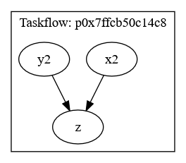

.. SPDX-FileCopyrightText: 2026 Jan Kleinert <jan.kleinert@dlr.de>
..
.. SPDX-License-Identifier: MPL-2.0

*************
Usage 
*************

If you are interested in using grunk as a backend for your C++ code, the :ref:`section on static mode <usage-static-mode>` and 
the :ref:`section on parallel execution <usage-parallel-execution>` are a good starting point. 

If you plan to use grunk entirely for scripting and manipulating grunk recipes, these sections can be skipped, because the python bindings only support grunk's dynamic mode and the reading and writing of grunk recipes to file. However, to fully grasp grunk's caching, lazy evaluation and automatic invalidation logic, it may be beneficial not to do so.

.. _usage-static-mode:

Static Mode
===========

As an introductory example, consider the following function
that adds two ``double``\s and is a bit talkative about it.

.. code-block:: cpp
   
   double add(double const& l, double const r)
   {
       std::cout << "Adding " << l << " and " << r << std::endl;
       return l + r;
   };

grunk lets you delay the evaluation of the function until the result is queried.

.. code-block:: cpp

   #include <grunk/grunk.hpp>

   auto o = grunk::action(&add, 1.2, 40.8).output();
   o.set_id("o");
   
   std::cout << "Until here, nothing has happened" << std::endl;

   std::cout << o.value() << std::endl;
   std::cout << o.value() << std::endl;

.. code-block:: console

   Until here, nothing has happened
   Adding 1.2 and 40.8
   42
   42

In the first line no computation takes place, the function ``add`` is not evaluated.
Instead, 
a new ``Action`` instance ``o`` is created using ``grunk::action``.
The arguments are the label ``"o"``, a function pointer ``&add`` and two arguments
that shall be passed into the function. With ``.output()`` we retrieve a handle
to the first (and in this case only) output of the action, which is of
type ``Feature<double>``. 

Internally, ``o`` depends on the action created
by ``grunk::action``, which in turn depends on two ``Feature<double>`` instances, 
one holding the value ``1.2`` and the other the value ``40.8``. With this dependency 
information, grunk can delay the computation to the point when ``o.value()`` 
is called. At this time, the function must be evaluated and the result, ``42``, is 
stored in ``o``. The next time the value is queried, the compuation is not repeated,
the cached result is returned. This is called **lazy evaluation**, because computations 
are delayed until the last point possible and only necessary calculations are performed.

Let's modify the above code example a bit. 

.. code-block:: cpp
   
   grunk::Feature x(1.2).with_id("x");
   grunk::Feature y(15.2).with_id("y");
   grunk::Feature z(25.6).with_id("z");

   auto a = grunk::action("a", &add, x, y).output();
   auto b = grunk::action("b", &add, a, z).output();

We have created three independent features ``x,y,z``. The feature
``a`` is the result of adding ``x`` and ``y`` and the feature ``b`` is the 
result of adding ``a`` and ``z``.

If we would now query the value of ``a``, ``b`` would 
not be computed, because ``a`` does not depend on ``b``. If instead,
we were to query the value of ``b``, ``a`` would have to be computed first. 
Let's try this:

.. code-block:: cpp
   
   std::cout << b.value() << std::endl;

.. code-block:: console
   
   Adding 1.2 and 15.2
   Adding 16.4 and 25.6
   42

If we now were to change ``z``, ``b`` would have to be recomputed the 
next time its value is queried. ``a`` which does not depend on ``z``
does not need to be recomputed.

.. code-block:: cpp
   
   z.change_value() = 24.2;
   
   std::cout << "No calculations done until this point" << std::endl;
   std::cout  << b.value() << std::endl;

.. code-block:: console 
   
   No calculations done until this point
   Adding 16.4 and 24.2
   40.6

If we were to change ``x``, both ``a`` and ``b`` have to be re-computed and 
grunk knows this:

.. code-block:: cpp 
   
   x.change_value() = 2.6;

   std::cout << "No calculations done until this point" << std::endl;
   std::cout  << b.value() << std::endl;

.. code-block:: console
   
   No calculations done until this point
   Adding 2.6 and 15.2
   Adding 17.8 and 24.2
   42

This functionality of only invalidating those features, that depend 
on a changed feature is called **automatic invalidation**. 

Lazy evaluation and automatic invalidation come with the trade-off of having to 
store dependency information, but it pays off
for big workflows with many computationally expensive functions. This becomes especially 
apparent in explorative design or automated optimization workflows, where input parameters 
can be expected to be altered frequently.

Conceptually, the ``Feature<double>`` correspond to a node in a *directed acyclic graph* 
(DAG). This graph is often called a **feature tree**. grunk retains these feature trees 
by retaining parent-child relations in the ``Feature<T>`` instances.

This mode of operation is also called **static mode**, because all types and functions are known at compile time.
If you want to use types and functions provided by plugins which are loaded at run time, you have to use grunk's **dynamic mode**, see the section on :ref:`dynamic mode<_usage-dynamic-mode>`.

.. _usage-parallel-execution:

Parallel Execution
==================

Consider the following grunk recipe:

.. code-block:: cpp

   #include <grunk/grunk.hpp>
   
   auto x1 = grunk::feature(1.);
   auto x2 = grunk::action([](double v){ return v + 1.; }, x1).output();
   x2.set_id("x2");

   auto y1 = grunk::feature(2.);
   auto y2 = grunk::action([](double v){ return v * 2.; }, y1).output();
   y2.set_id("y2");

   auto z = grunk::action([](double a, double b){ return a + b; }, x2, y2).output();
   z.set_id("z");

Setting aside that parallel execution is not reasonable for this example, note that ``x2`` and ``y2`` can be computed in parallel, because they do not depend on each other.

Since grunk tracks parametric dependencies, it can use this information to deduce which parts of a parametric tree 
can be executed in parallel - provided that the functions themselves are thread-safe.

To do so, we can use the ``ParallelExecutor``:

.. code-block:: cpp

   grunk::ParallelExecutor executor(z);
   executor.run();

You can also specify the number of threads to use for the parallel execution:

.. code-block:: cpp

   int nthreads = 4;
   grunk::ParallelExecutor executor(nthreads, z);
   executor.run();

The parallel executor uses the `taskflow <https://github.com/taskflow/taskflow>`_ library under the hood. If you want to see the actual task graph that gets executed, you can dump it to a file:

.. code-block:: cpp 

   std::string graphviz = executor.get_taskflow().dump();

   std::ofstream fout("my_taskflow.dot");
   fout << graphviz;




The class ``ParallelExecutor`` takes a set of features as input and executes all computations necessary to evaluate these features in parallel, if possible.

.. code-block:: cpp

   #include <grunk/grunk.hpp>

   auto x  = grunk::feature(1.).with_id("x");
   auto y  = grunk::action([](double v){ return v + 1.; }, x).output().with_id("y");
   auto y1 = grunk::action([](double v){ return v * 2.; }, y).output().with_id("y1");
   auto y2 = grunk::action([](double v){ return v * 3.; }, y).output().with_id("y2");
   
   grunk::ParallelExecutor executor(y1, y2);

Note, that parallel execution is only possible in static mode. 
Dynamic mode relies on LUA. Like most scripting languages, LUA is single-threaded 
and does not support parallel execution.

.. _usage-dynamic-mode:

Dynamic Mode
============

Before we dive into the parametric trees of grunk's dynamic mode, let's first see how to interact with the underlying LUA state.

Interacting with the LUA state
------------------------------

Grunk's dynamic mode is the basis for using grunk with plugins. It relies on a runtime reflection system and a type-erased object called ``grunk::object``. This allows grunk to work with any kind of type and function provided by plugins, without the need to know about them at compile time.

An instance of ``grunk::state`` is used to manage the dynamic state and register types and functions in an internal LUA state.

In practice, functions and types are registered in a ``grunk::state`` via grunk plugins, see the :ref:`next section <using-plugins>` section. For simplicity, assume for now that the type ``MyScalar`` and a function ``add`` are registered in the grunk state and can be used in the feature tree.

.. code-block:: cpp

   #include <grunk/grunk.hpp>

   struct MyScalar
   {
       double get() const { return v; }
       double v;
   };

   grunk::state grunk;
   grunk.register_type<MyScalar>("MyScalar")
   .add_constructor<double>()
   .add_member_function("get", &MyScalar::get);

   grunk.register_function(
      "add", 
      [](MyScalar const& l, Myscalar const& r){ 
         return l + r; 
      }
   );

Now, we can use the registered type and function in a LUA script. 

.. tabs:: 

   .. code-tab:: cpp 

         #include <grunk/grunk.hpp>
   
         grunk::state grunk;

         /* type and function registration omitted here */

         auto env = grunk.create_env();
         env.eval(R"(
            local x = MyScalar.new(17.)
            local y = MyScalar.new(25.)
            local z = add(x,y)
            result = z:get() ^ 2 + 5
         )");
         std::cout << env.get<double>("result") << std::endl;

   .. code-tab:: python 
   
         import grunk

         # type and function registration omitted here

         env = grunk.create_env()
         env.eval("""
            local x = MyScalar(17.)
            local y = MyScalar(25.)
            local z = add(x,y)
            result = z:get() ^ 2 + 5
         """)
         print(env.get("result").as_float())


The script passed to ``env.eval`` can be any valid LUA code. The function ``env.get`` can be used to retrieve any variable from the LUA state and cast it to a type that we can deal with in C++ or Python.
We can retrieve the variable as a grunk::object and then use the ``as`` function to cast it back to the actual type.
Conversely, we can also create a grunk::object from a C++ type and pass it to the LUA state.

.. code-block:: cpp

   #include <grunk/grunk.hpp>

   grunk::state grunk;

   /* type and function registration omitted here */
   
   auto env = grunk.create_env();

   env["x"] = MyScalar(17.);
   env["y"] = MyScalar(25.);
   env.eval("result = add(x,y):get()");
   std::cout << env.get<double>("result") << std::endl;


The usage from Python is very similiar, with a few minor caveats. 

Firstly, python types cannot be registered in the grunk state, because they are not known to C++. Instead, we can only work with native LUA types and types that are registered in the grunk state via plugins.

Secondly, for convenience, the `grunk` module comes with a default `grunk::state` instance and
the member functions of `grunk::state` are exposed as free functions. So from python we have the choice of working with the default state or creating 
our own state and working with it.

.. code-block:: python

   import grunk

   # use the default stae
   env = grunk.create_env()

   # or create a new state called grnk and use it
   grnk = grunk.state()
   env2 = grnk.create_env()

Dynamic Features and Actions in LUA
-----------------------------------

Notice that in the example above, we have only used the functions in a dynamic context. We did not make use of grunk's dependency tracking. 
The following example shows how to use grunk's dynamic mode together with the dependency tracking of features and actions.

We can create a parametric environment from our ``grunk::state``. Within this environment, all functions are decorated as a ``grunk::Action``, a function wrapper that tracks the dependency.

.. tabs::

   .. code-tab:: cpp 

         #include <grunk/grunk.hpp>
   
         grunk::state grunk;

         auto env = grunk.create_parametric_env();
         env.eval(R"(
            x = grunk.feature(2.)
            y = grunk.feature(38.)

            a = x ^ 2
            b = a + y  

            b1 = b:value()

            x:set_value(1)

            b2 = b:value()
         )");

         // prints 42
         auto b1 = env.get("b1").as<double>();
         std::cout << "b1 = " << b1 << std::endl;

         // prints 39
         auto b2 = env.get("b2").as<double>();
         std::cout << "b2 = " << b2 << std::endl;

         auto y = env.get_feature("y"); // short for env.get<grunk::DynamicFeature>("y")
         y.set_value(41);

         // prints 42
         auto b3 = env.get_feature("b").value().as<double>();
         std::cout << "b3 = " << b3 << std::endl;


   .. code-tab:: python 
   
         import grunk

         env = grunk.create_parametric_env()
         env.eval("""
            x = grunk.feature(2.)
            y = grunk.feature(38.)

            a = x ^ 2
            b = a + y  

            b1 = b:value()

            x:set_value(1)

            b2 = b:value()
         """)

         # prints 42
         b1 = env["b1"].as_float()
         print(f"b1 = {b1}")

         # prints 39
         b2 = env["b2"].as_float()
         print(f"b2 = {b2}")

         y = env.get_feature("y")
         y.set_value(41)

         # prints 42
         b3 = env.get_feature("b").value().as_float()
         print(f"b3 = {b3}")

Observe carefully how the lazy evaluation and automatic invalidation logic works here. The first time ``b:value()`` is called from the LUA script, the value of the feature is queried and the parametric tree is evaluated. The caches of every feature of the underlying parametric tree are filled. Subsequently the value of ``x`` is changed, which invalidates ``a`` and ``b``. The next time ``b:value()`` is called, the parametric tree is reevaluated and the value of ``b`` changes. 

In the following, we are retrieving the feature ``y`` from the ``grunk::state`` and manipulate it in C++/Python. As we change the value, the cache of ``a`` remains intact, but the cache of ``b`` is invalidated. Querying the value of ``b`` again (this time from C++/Python), only part of the feature tree is re-evaluated and the value of ``b`` changes again.

Using Custom Types
------------------

TODO. Show the Feature.as syntax

Dynamic Features and Actions in C++/Python
------------------------------------------

TODO

Mixing static and dynamic mode in C++
-------------------------------------

TODO

Containers
----------

TODO. Only ``std::vector`` handled so far

Custom Pointers and Smart Pointers
----------------------------------

Not yet implemented.

.. _using-plugins:

Grunk plugins
=============

TODO

.. What kind of types can we store in a ``Feature``? What kind of functions can we 
.. use with grunk?

.. (Almost) anything goes: Any kind of type can be stored in a ``Feature``. Functions have
.. to be **referentially transparent**, which means they may not alter their inputs.
.. Internally, grunk checks if a function passed to ``grunk::action`` can be invoked given only
.. `const` references. 

.. The power of grunk comes with its plugin system. A grunk plugin supplies types and 
.. functions that can be used as building blocks of a feature tree. Imagine that instead of 
.. using our ``add`` function from above, we now want to build a feature tree with the functions
.. ``SomePluginA::add`` and ``SomePluginB::multiply``, both taking instances of 
.. ``SomePluginA::MyDouble`` as arguments. 

.. In this section of the documentation, we will first learn how to use grunk environments to manage
.. and install grunk plugins and then see how we can use them as part of a model written in C++ or Python. 

.. Grunk environments
.. ------------------

.. In essence, a grunk plugin is a shared library (.so/.dll) that is responsible for registering types and 
.. functions using reflect. 

.. Let's assume that we have both plugins ``libSomePluginA.so`` and ``libSomePluginB.so`` in the 
.. directory ``/home/jan/grunk_plugins/`` *(Note that on Windows the file extension would be .dll)*. 
.. In the simpleste scenario, we can load the plugins using the ``PluginRegistry``. 

.. .. tabs::

..    .. code-tab:: cpp 
   
..          grunk::get_plugin_registry().prepend_path("/home/jan/grunk_plugins/");
..          grunk::get_plugin_registry().load("SomePluginA");
..          grunk::get_plugin_registry().load("SomePluginB");

..    .. code-tab:: python 
   
..          grunk.get_plugin_registry().prepend_path("/home/jan/grunk_plugins/")
..          grunk.get_plugin_registry().load("SomePluginA")
..          grunk.get_plugin_registry().load("SomePluginB")

.. ``PluginRegistry::prepend_path`` prepends the search path for plugins by a directory
.. passed as an argument and ``PluginRegistry::load`` will load a plugin from the 
.. search directories.

.. .. note::

..    It is not recommended to load plugins like this. Prefer grunk environments.

.. Loading libraries like this can work, but it can become tedious if the libraries have 
.. downstream dependencies or we are loading several libraries of different versions that 
.. may or may not be compatible to each other. To circumvent this problem, it is better to 
.. use a package manager that handles version compatibility issues etc. 

.. For this reason, grunk builds on the conan API and introduces grunk environments.

.. The grunk CLI allows the generation of isolated environments for the installation of plugins
.. and their runtime dependencies into dedicated directories as well as functions for installing 
.. grunk plugins from a local cache or a remote host. This functionality is built upon the conan API.

.. .. note:: 

..    The term "environment" may not be properly used here. For our purposes, it is just a 
..    dedicated directory that stores a set of plugins that are compatible to each other as well as 
..    their respective runtime dependencies.

.. Let us create a new grunk environment called ``cad`` and install the plugin ```grocc/0.1.1``` into it. 
.. Enter the following command into the command line:

.. .. code:: console 

..    grunk env create cad grocc/0.1.1

.. This command first checks if ``grocc/0.1.1`` is already available in the local conan cache. Otherwise it 
.. searches the grunkcenter and conancenter in this order. At the time of writing, the grunkcenter is simply 
.. our DLR internal Gitlab package registry. 

.. If it finds a binary package fitting to the local default conan profile, the plugin will be downloaded 
.. in binary form. Otherwise grunk *(resp. conan)* will download the Plugin's source code and try to compile 
.. the plugin locally. The latter can take some time. Have a coffee.

.. If grunk *(resp. conan)* claim that the plugin cannot be found, 
.. it is likely that the authentification token has expired and we must authenticate with grunkcenter again: 

.. .. code:: console

..    grunk user auth <GITLAB_USER_NAME> -p <GITLAB_API_TOKEN>

.. The command ``grunk env list`` will list all environments, ``grunk env show cad`` would show 
.. all plugins installed in the environment ``cad`` and ``grunk env remove cad`` would remove the
.. environment ``cad```. Type ``grunk env --help`` for details.

.. Note that you can have any number of environments. This can also help with managing different 
.. versions of the same plugin in their respecitve isolated environments. 

.. ``PluginRegistry::activate_env(std::string const& env_name)`` can be used to prepend grunk's 
.. search path based on the environment. Then we can load any plugin within this environment using
.. ``PluginRegistry::load`` as before. 

.. Note that there is a shorthand for loading all plugins within an environment: ``PluginRegistry::load_env``.

.. Using grunk plugins
.. -------------------

.. Let's assume that we have both plugins ``SomePluginA`` and ``SomePluginB`` installed in 
.. a grunk environment called `my_env`

.. .. tabs::

..    .. code-tab:: cpp 
   
..          grunk::get_plugin_registry().load_env("my_env");

..          grunk::Feature x("x", "SomePluginA::MyDouble", 4.3);
..          grunk::Feature y("y", "SomePluginA::MyDouble", 3.3);
..          grunk::Feature z("z", "SomePluginA::MyDouble", 2.0);

..          auto a = grunk::action("a", "SomePluginA::add", x, y).output();
..          auto b = grunk::action("b", "SomePluginB::multiply", a, z).output();

..    .. code-tab:: python 
   
..          grunk.get_plugin_registry().load_env("my_env")

..          x = grunk.Feature("x", "SomePluginA::MyDouble", 4.3)
..          y = grunk.Feature("y", "SomePluginA::MyDouble", 3.3)
..          z = grunk.Feature("z", "SomePluginA::MyDouble", 2.0)

..          a = grunk.action("a", "SomePluginA::add", x, y).output()
..          b = grunk.action("b", "SomePluginB::multiply", a, z).output()

.. When working with plugins, we 
.. have to use grunk's :ref:`dynamic mode<dynamic-mode>`, while the :ref:`first example<getting-started>` used grunk's 
.. :ref:`static mode<static-mode>`. In essence, this means that all features of the above feature tree are now instances of ``Feature<reflect::DynamicObject>``, 
.. see also :ref:`design principles<design-dynamic-sublanguage>`. Because the plugins are loaded
.. at runtime, the calling code does not know about the type ``SomePluginA::MyDouble`` and the 
.. functions ``SomePluginA::add`` and ``SomePluginB::multiply`` directly. Instead, it relies on 
.. a runtime reflection system used by grunk's plugin system. 

.. .. note::

..    Currently, static mode is not supported via the python bindings.

.. If we evaluate the tree by querying ``b.value()``, we will retrieve an instance of ``reflect::DynamicObject``.
.. Luckily, the type ``SomePluginA::MyDouble`` has a public data member called ``value`` which is of type
.. ``double``, see also the section on :ref:`writing plugins<writing-plugins>`. We can use ``reflect::DynamicObject::get`` to retrieve this data member and then cast it to a 
.. type that we can deal with:

.. .. tabs::

..    .. code-tab:: cpp 
  
..          auto b_result = b.value().get("value").as<double>();
..          std::cout << b_result << std::endl;

..    .. code-tab:: python 
  
..          b_result = b.value().get("value").as_float();
..          print(b_result)

.. .. code-block:: console

..    15.2


.. .. _writing-plugins:

.. Writing Plugins
.. ---------------

.. Let us assume we are the authors of the plugin ``SomePluginA`` from the 
.. :ref:`previous example<using-plugins>`, so our code looks like this:

.. .. code-block:: cpp
   
..    struct MyDouble {
..        MyDouble(double v) : value(v) {}
..        double value;
..    };

..    MyDouble add(MyDouble const& l, MyDouble const& r)
..    {
..        return {l.value + r.value};
..    }

.. We can make the type ``MyDouble`` and the function ``add`` available for 
.. use in a feature tree by creating a grunk plugin. We do so, by including the 
.. grunk header ``grunk/grunk.hpp`` and inheriting from ``grunk::IPlugin``. We 
.. have to overwrite the virtual methods ``name``, ``version`` and ``init``. 
.. In the ``init`` function we can register all types and functions we want to 
.. make available in our grunk interface.

.. .. code-block:: cpp 

..    class SomePluginA: public grunk::IPlugin
..    {
..    public:
   
..        virtual std::string name() const override final
..        {
..            return "SomePluginA";
..        }
   
..        virtual std::string version() const override final
..        {
..            return "2.4.19";
..        }
   
..        virtual void init() const override final 
..        {
..            // register types
   
..            register_type<MyDouble>("MyDouble")
..            .add_constructor<double>()
..            .add_data_member(&MyDouble::value, "value")
..            .add_member_function(
..                [](MyDouble const& d){
..                    YAML::Node out(d.value);
..                    return out;
..                },
..                "serialize"
..            )
..            .add_member_function(
..                [](YAML::Node const& y){
..                    return MyDouble(y.as<double>());
..                },
..                "deserialize"
..            );
   
..            // register functions
   
..            register_function(&add, "add", "adds two MyDouble instances");
..        }
   
..    };
..    GRUNK_REGISTER_PLUGIN(SomePluginA)

.. After creating the derived class ``SomePluginA``, we need to register the plugin using 
.. the C macro ``GRUNK_REGISTER_PLUGIN``. If the compilation unit containing this code 
.. is compiled to a shared library, the plugin can be used in grunk.

.. Let us take a closer look at the body of the ``init`` function. 

.. First, the type 
.. ``MyDouble`` is registered with the call to ``grunk::register_type``. It is given a 
.. name to look up the type in grunk's type registry. 

.. Though this is not necessary 
.. for grunk's plugin system, we are letting the type registry know about the 
.. constructor taking a ``double`` with ``add_constructor``. This allows users of grunk to 
.. create instances of ``MyDouble``, even if the plugin is loaded at runtime and the calling 
.. program does not know about the existence of ``MyDouble`` at compile time. 

.. Next, the public data member ``value`` is added to the grunk interface. It can be queried
.. with the string identifier "value", and this was already used in the example 
.. :ref:`"Using Plugins"<using-plugins>`.

.. If ``MyDouble`` had any public member functions, we could register them using 
.. ``add_member_function``. But ``add_member_function`` is more powerful: We can use it to 
.. add free functions as methods, even if they don't exist in the definition of the type. 
.. If this free function takes a reference to ``MyDouble`` as first argument, it behaves like a normal
.. member function. If it does not, it behaves like a static member function. 

.. In the above code block, we are adding the free function ``serialize`` as a method to 
.. ``MyDouble`` using ``add_member_function``. The free function 
.. creates a ``YAML::Node`` (see `yaml-cpp <https://github.com/jbeder/yaml-cpp>`_) from an 
.. instance of ``MyDouble``. In this example, the ``YAML::Node`` is very simple: It only holds the 
.. ``MyDouble::value`` as a ``double``. This information is enough to uniquely transform an instance 
.. of ``MyDouble`` to yaml and back again.

.. In addition, a "static" member function is added called ``deserialize``. This method takes 
.. a ``YAML::Node`` and creates an instance of ``MyDouble``. 

.. Adding the functions

.. .. code-block:: cpp
   
..    YAML::Node serialize(Type const&);
..    Type deserialize(YAML::Node const&);

.. as member functions to a type ``Type`` is mandatory, if 

..  * it should be possible to use ``Type`` instances as a root parameter of a grunk feature tree **and**
..  * it should be possible to write and read feature trees with ``Type`` instances as root parameters to/from a grunk file.

.. Finally, in the last line of the ``init`` function, the function ``add`` is registered by a 
.. call to ``register_function``. It is given a string identifier for lookup in grunk's function
.. registry and (optionally) a short string that serves as a documentation for that function. 

.. grunk is designed so that it should be easy to add a grunk interface to an existing C++ 
.. code base.

.. .. _sharing-plugins:

.. Sharing Plugins 
.. ---------------

.. To Do


.. _reading-and-writing-to-file:

Reading and writing to file
===========================

TODO: This is outdated

We can write the feature tree from the :ref:`previous section<using-plugins>` to a file, 
the *grunk recipe*, with the command

.. tabs::

   .. code-tab:: cpp 
   
      grunk.write("/home/jan/my_grunk_files/simple.grr.yml", b);

   .. code-tab:: python 
   
      grunk.write("/home/jan/my_grunk_files/simple.grr.yml", b)

The grunk recipe will have the following contents:

.. code-block:: yaml 
   
   uses:
     grunk: 0.1.0
     SomePluginA: 2.4.19
     SomePluginB: 1.3.0
   parameters:
     x: SomePluginA.MyDouble.new(4.3)
     y: SomePluginA.MyDouble.new(3.3)
     z: SomePluginA.MyDouble.new(2.0)
    steps: |
      a = SomePluginA.add(x, y)
      b = SomePluginB.multiply(a, z)

All information needed to reproduce the output of ``b`` gets written into the file in 
yaml format. The steps are a LUA script. The function ``grunk::write`` accepts any number of ``Feature`` 
instances or an instance of ``grunk::Recipe``, see :ref:`the section on grunk recipes<grunk-recipes>`. The following commands all 
yield the same file *(except for the order of independent parameters)*:

.. tabs::

   .. code-tab:: cpp 
   
         grunk.write("/home/jan/my_grunk_files/simple.grr.yml", b);
         grunk.write("/home/jan/my_grunk_files/simple.grr.yml", b, a, x, y, z);
         grunk.write("/home/jan/my_grunk_files/simple.grr.yml", z, b);

   .. code-tab:: python 
   
         grunk.write("/home/jan/my_grunk_files/simple.grr.yml", b)
         grunk.write("/home/jan/my_grunk_files/simple.grr.yml", b, a, x, y, z)
         grunk.write("/home/jan/my_grunk_files/simple.grr.yml", z, b)

The file can then be read by grunk and the feature tree can be 
reconstructed, as long as the two plugins have been loaded:

.. tabs::

   .. code-tab:: cpp 
   
         grunk::get_plugin_registry().load_env("my_env");

         auto recipe = grunk.read("/home/jan/my_grunk_files/simple.grr.yml")
         auto b = recipe.at("b");
         auto b_result = b.value().get("value").as<double>();
         std::cout << b_result << std::endl;

   .. code-tab:: python 

         grunk.get_plugin_registry().load_env("my_env")

         recipe = grunk.read("/home/jan/my_grunk_files/simple.grr.yml")
         b = recipe["b"]
         b_result = b.value().get("value").as_float();
         print(b_result)

.. code-block:: console

   15.2

The function ``grunk::state::read`` returns a ``Recipe`` instances, which stores the re-constructed
features, see :ref:`the next section<grunk-recipes>`. Retrieval is based on the string ids of the features. 

Plugins enable experts to create and use domain specific building blocks to model 
complex systems. grunk files enable experts to share workflows in a collaborative and 
multidisciplinary environment.


.. _grunk-recipes:

Grunk Recipes 
=============

You have seen in :ref:`the previous section<reading-and-writing-to-file>` how individual features or 
a set of features can be written to a *grunk recipe*. In grunk, there exists a class to model 
such a recipe in :ref:`dynamic mode<dynamic-mode>`, namely ``grunk::Recipe``. 

In a certain sense, a ``grunk::Recipe`` is just a container of features. You can construct a recipe from from a ``grunk::state`` and add features to it.

.. tabs::

   .. code-tab:: cpp 

         auto grunk = grunk::state();

         auto a = grunk.feature("PluginA.Scalar", 17.);
         auto b = grunk.feature("PluginA.Scalar", 15.);
         auto c = grunk.action("PluginA.add", a, b);
         
         auto recipe1 = grunk.create_recipe();
         recipe1["a"] = a;
         recipe1["b"] = b;
         recipe1["c"] = c;
         recipe1.tag(); // adds the labels "a", "b" and "c" to the features

         auto recipe2 = grunk.create_recipe();
         recipe2["x"] = grunk.feature("PluginA.Scalar", 2.);
         recipe2["y"] = grunk.feature("PluginA.Scalar", 5.);
         recipe2["z"] = grunk.action("PluginB.multiply", recipe2["x"], recipe2["y"]);
         recipe2.tag(); // adds the labels "x", "y" and "z" to the features

   .. code-tab:: python


         a = grunk.feature("PluginA.Scalar", 17.)
         b = grunk.feature("PluginA.Scalar", 15.)
         c = grunk.action("c", "PluginA::add", a, b)
         recipe1 = grunk.create_recipe()
         recipe1["a"] = a
         recipe1["b"] = b
         recipe1["c"] = c
         recipe1.tag() # adds the labels "a", "b" and "c"

         recipe2 = grunk.create_recipe()
         recipe2["x"] = grunk.feature("PluginA.Scalar", 2.)
         recipe2["y"] = grunk.feature("PluginA.Scalar", 5.)
         recipe2["z"] = grunk.action("PluginB.multiply", recipe2["x"], recipe2["y"])
         recipe2.tag() # adds the labels "x", "y" and "z" to the features

Notice that features can be queried by their id:

.. tabs::

   .. code-tab:: cpp 

      auto x = recipe2["x"];

   .. code-tab:: python 

      x = recipe2["x"]

In addition to storing features, recipes can store recipes. Think of them as building-blocks for your model. 
For instance, a recipe for an aircraft may have recipes for modeling wings, fuselages or a landing gear.
Continuing our above example, we can insert ``recipe2`` as a subrecipe of ``recipe1`` and assign a label to it:

.. tabs::

   .. code-tab:: cpp 

         recipe1.insert_recipe("multiplication", std::move(recipe2));

   .. code-tab:: python 

         recipe1.insert_recipe("multiplication", recipe2);

``::grunk::Recipe``\s can be used like functions in the sense, that we can interpret independent 
features as arguments and any other feature as an output. These functions can in turn be treated like a new 
compute node in a feature tree. This helps us with encapsulation: We can build complex recipes using a set of 
smaller recipes.

Let us invoke the new subrecipe ``multiplication`` of ``recipe1`` on ``a`` and ``b``. 


.. tabs::

   .. code-tab:: cpp 

      // Retrieve a proxy to the inner recipe
      auto multiplication = recipe1.recipes["multiplication"];
   
      // Map the independent features of the inner recipe to features of the outer recipe
      multiplication["x"] = a;
      multiplication["y"] = b;

      // Map the output feature of the inner recipe to a new feature in the outer recipe and assign a label to it
      auto d = multiplication.get("z").with_id("d");

      // Add the new feature to the outer recipe
      recipe1["d"] = d;

   .. code-tab:: python 

      # Retrieve a proxy to the inner recipe
      multiplication = recipe1.recipes["multiplication"]

      # Map the independent features of the inner recipe to features of the outer recipe
      multiplication["x"] = a
      multiplication["y"] = b

      # Map the output feature of the inner recipe to a new feature in the outer recipe and assign a label to it
      d = multiplication.get("z").with_id("d")

      # Add the new feature to the outer recipe
      recipe1["d"] = d

Basically, we retrieve a proxy to the inner recipe and then we can treat the inner recipe like a function. We can
assign features from the outer recipe to the independent features of the inner recipe and we can retrieve the output feature of the inner recipe and assign it to a new feature in the outer recipe. In our example, we do the following:

 * Take feature ``a`` as input for the inner independent feature with id ``x``.
 * Take feature ``b`` as input for the inner independent feature with id ``y``. 
 * Map the inner output feature ``z`` to a newly created feature in the outer recipe and assign 
   the new feature with the id ``d``.

The inner recipe will be uneffected by this action. Since all inner features have a default value, 
it is not necessary to assign all input features with a feature from the outer recipe. As an example, 
it would also have been okay, to just replace ``x`` with say ``c`` and keep ``y`` as is.

Exporting the recipe will result in the following yaml-representation:

.. code-block:: yaml 
   
   uses:
     grunk: 0.2.1
     PluginA: 0.1.0
   parameters:
     a: PluginA.Scalar(17)
     b: PluginA.Scalar(15)
   steps: |
     c = PluginA.add(a, b)
     multiplication = recipes.multiplication
     multiplication.x = a
     multiplication.y = b
     d = multiplication.z
   recipes:
     multiplication:
       uses:
         PluginB: 0.1.0
         PluginA: 0.1.0
       parameters:
         x: PluginA.Scalar(2)
         y: PluginA.Scalar(5)
       steps: |
         z = PluginB.multiply(x, y)

.. _types-of-compute-nodes:

TODO: Example with Placeholder, explain dependence of inner recipe. Add picture from paradigm-x meeting.

Types of Compute Nodes
======================

TODO: This is outdated. Instead, we should document module, once it is implemented and 
how to wrap std::vector. 

With grunk, we can build parametric trees. A tree is a directed acyclic graph (DAG), where the 
nodes are features and compute nodes. Features are inputs and outputs of compute nodes. A compute node 
can have any number of inputs and any number of outputs. A feature can have at most one input. 
If it has no input, it is an independent input feature, or a `parameter`. If it has one input, the input
must be a compute node and the feature is an output of a computation. compute nodes are the `"steps"` that
can be used as part of a grunk recipe.

Compute nodes can be of the following types:

.. _action:

Action
------

Use ``grunk::action`` to create compute nodes representing a single function call. 
Actions can be of either static type, wrapping a normal C++ function or dynamic type, 
wrapping a function that is stored in the static function registry, see :ref:`Getting Started<getting-started>`
and :ref:`Using Plugins<using-plugins>`.

.. _expression:

Expression
----------

Use ``grunk::expression`` to create a compute node representing an expression.


.. tabs::

   .. code-tab:: cpp 

         auto a = grunk::Feature("x", "double", 0.);
         auto b = grunk::Feature("y", "double", 0.75);
         auto c = grunk::expression("z", "2*cos(x)*y+1", a, b);

   .. code-tab:: python

         a = grunk.Feature("x", "double", 0.)
         b = grunk.Feature("y", "double", 0.75)
         c = grunk.expression("z", "2*cos(x)*y+1", a, b)

   .. code-tab:: yaml

         uses:
           grunk: 0.2.1
         parameters:
           x: !<double> 0
           y: !<double> 0.75
         steps:
           - !<expr> [z, 2*cos(x)*y+1]


Under the hood, `muparser <https://beltoforion.de/en/muparser/>`_ is used and thus 
most (all?) functionality of muparser is supported.

.. _vec:

Vec
---

Use ``grunk::vec`` to map several ``DynamicFeature``\s to a ``DynamicFeature``, which type-erases a 
``std::vector<reflect::DynamicObject>``.

.. tabs::

   .. code-tab:: cpp 

         auto x = grunk::Feature("x", "double", 0.1);
         auto y = grunk::Feature("y", "double", 0.2);
         auto v = grunk::vec("z", x, y);

   .. code-tab:: python

         x = grunk.Feature("x", "double", 0.1)
         y = grunk.Feature("y", "double", 0.2)
         v = grunk.vec("z", x, y)

   .. code-tab:: yaml

         uses:
           grunk: 0.2.1
         parameters:
           x: !<double> 0.1
           y: !<double> 0.2
         steps:
           - !<vec> [[v], [x, y]]

This is useful to pass ``std::vector<T>`` instances to functions. Consider the following example:

.. code-block:: cpp

   Curve interpolate(std::vector<Point> const&);
   Surface interpolate(std::vector<Curve> const&);

If we have several ``DynamicFeature``\s type-erasing ``Curve``, we can 
create an ``std::vector<DynamicFeature>``, but firstly, ``interpolate`` is not 
invokable on this kind of vector and secondly, the creation of the vector must 
have a yaml-representation.

Therefore, we pass the curve features
to ``grunk::vec`` and obtain a ``DynamicFeature`` type-erasing 
``std::vector<reflect::DynamicObject>``. Any ``std::vector<T>`` used by a plugin 
is automatically registered with an additional converting constructor from 
``std::vector<reflect::DynamicObject>`` that checks for the correct type at runtime.

.. tabs::

   .. code-tab:: cpp 

         // ...
         auto curve1 = grunk::action("c1", "my_cad::interpolate", points1).output();
         auto curve2 = grunk::action("c2", "my_cad::interpolate", points2).output();
         auto curve3 = grunk::action("c3", "my_cad::interpolate", points3).output();
         auto curves = grunk::vec("curves", curve1, curve2, curve2);
         auto surface = grunk::action("s", "my_cad::interpolate", curves).output();

   .. code-tab:: python

         # ...
         curve1 = grunk.action("c1", "my_cad::interpolate", points1).output()
         curve2 = grunk.action("c2", "my_cad::interpolate", points2).output()
         curve3 = grunk.action("c3", "my_cad::interpolate", points3).output()
         curves = grunk.vec("curves", curve1, curve2, curve2)
         surface = grunk.action("s", "my_cad::interpolate", curves).output()

   .. code-tab:: yaml

         uses:
           grunk: 0.2.1
           my_cad: 1.0.0
         parameters:
           # ...
         steps:
           - !<my_cad::interpolate> [[c1], [points1]]
           - !<my_cad::interpolate> [[c2], [points2]]
           - !<my_cad::interpolate> [[c3], [points3]]
           - !<vec> [[curves], [c1, c2, c3]]
           - !<my_cad::interpolate> [[s], [curves]]

.. _script:

Script
------

Use ``grunk::script`` to create compute nodes representing a sequence of simple function calls. 
Consider it a concatenation of :ref:`actions<action>` in dynamic mode within a single compute node.

This is useful in two scenarios. Firstly, you can disable caching and lazy evaluation for a sequence 
of steps. Secondly, you can use it to instantiate new objects and modify them using non-const setters.

grunk dissallows any function, that can potentially alter its inputs. This includes any function that
takes a non-const reference as argument and in consequence, all non-const member functions. This is an 
important safeguard against dependency cycles in the feature tree: As part of the philosophy of grunk, 
information flows from inputs to outputs only and any feature in the tree is influenced only by predecessors.

This comes with a heavy restrition, since non-const members, e.g. setters are frequently used in 
object-oriented programs. Consider the following class

.. code-block:: cpp

   struct Pnt
    {
        Pnt() = default;

        inline void set_x(double x_) { x = x_; }
        inline void set_y(double y_) { y = y_; }
        inline void set_z(double z_) { z = z_; }

        double x{0.};
        double y{0.};
        double z{0.};
    };

Instantiating an instance of ``Pnt`` with grunk and then modifying it using ``set_x`` using 
``grunk::action`` is not allowed, because ``set_x`` is a non-const member function. 

Instead, you can create the instance and modify it as part of a script:


.. tabs::

   .. code-tab:: cpp 

         grunk::Feature u("u", "double", 0.1);
         grunk::Feature v("v", "double", 0.2);
         
         auto s = grunk::script(
            {
                  {"Pnt", {"p"}, {}},                 // create a new point p
                  {"Pnt::set_x", {}, {"p", u}},       // invoke non-const setter 
                  {"Pnt::set_y", {}, {"p", v}},       // invoke non-const setter
            },
            {"p"}                                   // return new point p
         ).output();

   .. code-tab:: python

         u = grunk.Feature("u", "double", 0.1)
         v = grunk.Feature("v", "double", 0.2)
         
         s = grunk.script(
            [
                  grunk.ScriptStep("Pnt", ["p"], []),           # create a new point p
                  grunk.ScriptStep("Pnt::set_x", [], ["p", u]), # invoke non-const setter 
                  grunk.ScriptStep("Pnt::set_y", [], ["p", v])  # invoke non-const setter
            ],
            returns=["p"]                           # return new point 
         ).output()

   .. code-tab:: yaml

         uses:
         grunk: 0.2.1
         parameters:
         u: !<double> 0.1
         v: !<double> 0.2
         steps:
         - !<script>
            steps:
               - !<Pnt> [[p], ~]
               - !<Pnt::set_x> [~, [p, u]]
               - !<Pnt::set_y> [~, [p, v]]
            returns:
               - p


In the above example, you define a script as a sequence of three steps, where each step is defined using
three parts. The first is the function name, the second is a list of names of the outputs of the function and 
the third is a list of inputs. The inputs can either be a ``DynamicFeature`` defined previously outside of the script
or the id of an intermediate variable created within the same script in a preceeding step. 

The second argument of ``grunk::script`` is a vector of output ids. These are any intermediate variables of 
the script that shall be passed as return features of the compute node. 

Note that here, no cycles are created because the non-const setters are not called on 
features, but on intermediate variables of the script during the evaluation of a single compute
node. The inputs ``u`` and ``v`` are not altered.

.. _recipe:

Recipe
------

``grunk::Recipe``\s can be used as compute nodes, see :ref:`the section on recipes<grunk-recipes>`. 
This is useful for modularizing a complex recipe into subrecipes, e.g. a recipe for a car can have 
subrecipes for the wheels, chassis, motor etc.