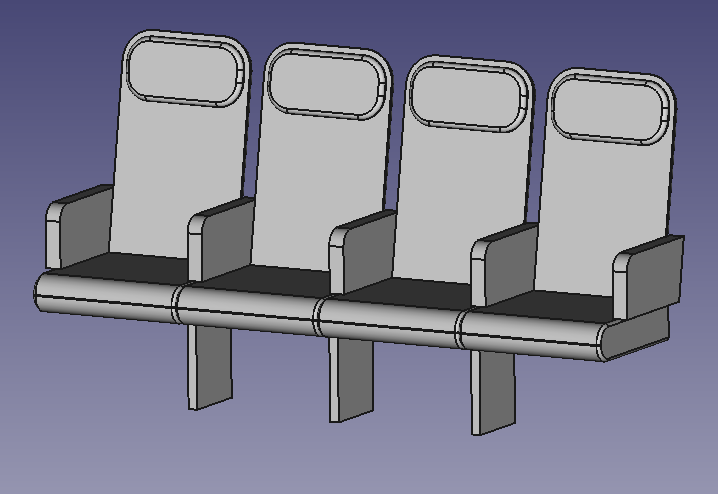

# Airplane Seats



Model a row of airplane seats, parametrized by the width of the sitting surface, the number of seats as well as the number of supports connecting the seats with the cabin floor.

The provided Python script sets up the recipe using grunk's Python bindings and exports it to yaml. Then it 
exports a brep file for several parameter choices.

```
grunk env create seat_example grocc/0.1.4 geo/0.2.1
python seat_model.py
```