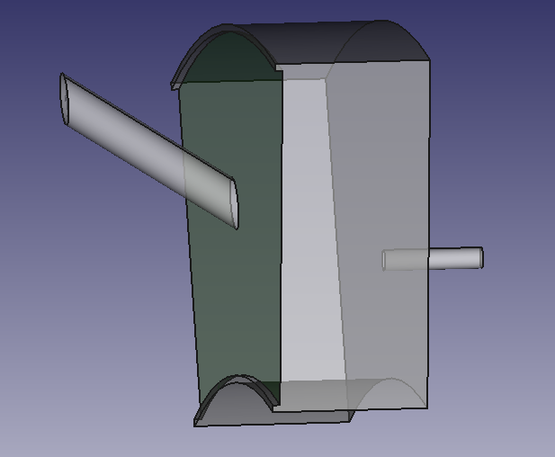

# Gas turbine cavity



A cavity in the secondary air system of a gas turbine. This model uses only grocc functionality. 

Setup the environment with 

```console
grunk env create test grocc/0.1.2
```

This will generate create an environment test with the needed plugin installed.

To (re-)generate the yml-recipe enter:

```console
python build_model.py
```

To open the YAML recipe, modify the model and save the output as brep enter:

```console
python run_model.py
```