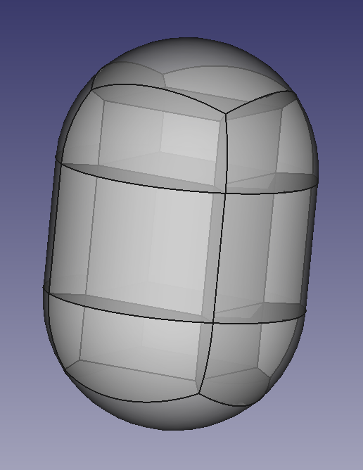

# Hydrogen tank with hexahedral elements



A simple hydrogen tank. This model uses only grocc functionality. 

The outer geometry consists of two half-spheres and a cylinder. The challenge in this example 
is to construct the geometry in such a way, that it can be meshed with hexahedral elements only.

Setup the environment with 

```console
grunk env create test grocc/0.1.2
```

To open the YAML recipe, modify the model and save the output as brep enter:

```console
python run_model.py
```