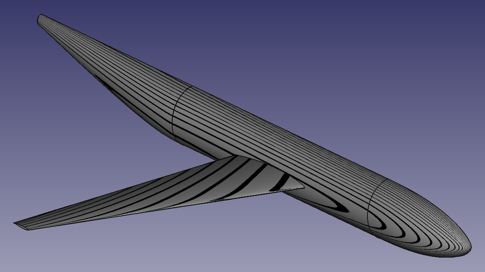

# Halfmodel of the Wing-Body-Reference model



In this example, we construct a half model of a fused wing-fuselage-configuration. The construction makes use of OpenCascade for all surface modeling and uses the CST Curve Builder of the TiGL library to generate the wing profile.

The fuselage is a solid constructed from three segments *(nose, central fuselage and tail)*, where each segment is bounded by a Bezier Surface. The rear of the tail of the fuselage is planar..

The wing is a solid constructed from two profiles, which are defined using a CST parametrization.

The final wing-body-reference is the Boolean union of the wing and the fuselage.

-------

Setup the environment with 

```console
grunk env create wingbody grocc/0.1.4 tigl/0.1.1
```

To open the YAML recipe, modify the model and save the output as brep and step enter:

```console
python run_model.py
```