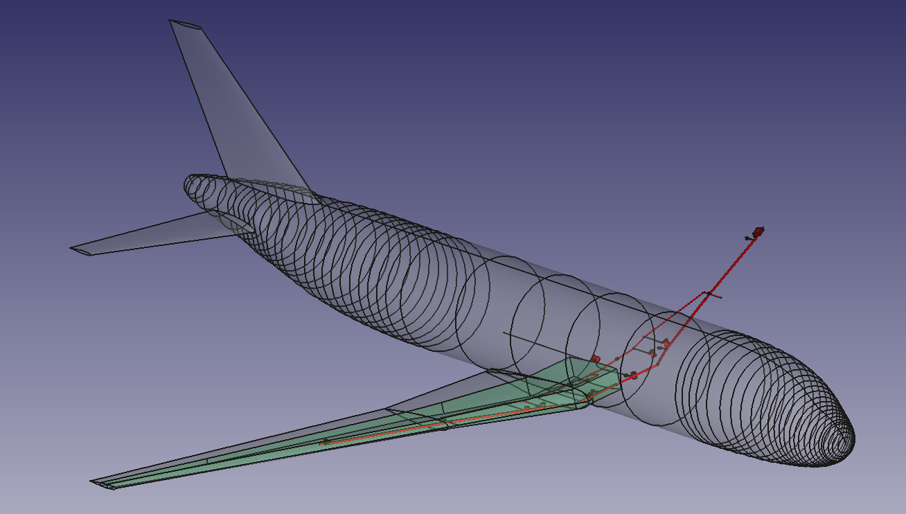

# Wing Fuel System



This example demonstrates
 - using the TiGL plugin to extract geometry from a CPACS file
 - Modify the extracted geometry using grocc
 - an automatically generated grunk recipe of a fuel system created in Codex
 - export a selection of geometries to brep files using grocc
 - merging two recipes into one.

 To run the example, make sure you have a grunk environment called "tigl" setup with `tigl-grunk/0.1.0` and `grocc/0.1.4` installed. 

 ```console
grunk env create tigl tigl-grunk/0.1.0 grocc/0.1.4
 ```

 Note that you can name the environment any way you want, but the python 
 script here uses the name tigl to load the environment.

 Execute `run_model.py` with python to run the example.

 There are two configurations to choose from, "D150" and "codex_example". The grunk recipe "CPACS_wingbox.grr.yml" opens a CPACS configuration and uses two spars and two ribs to generate a wingbox. The recipes "fuel_D150.grr" and "fuelsystem.grr.yml" are Codex-generated grunk recipes for the fuel system of the two configurations. 

 The python script opens both recipes, manipulates some input parameters and extracts some features from them, exports some geometric features as breps and finally merges both recipes to one in the final step.